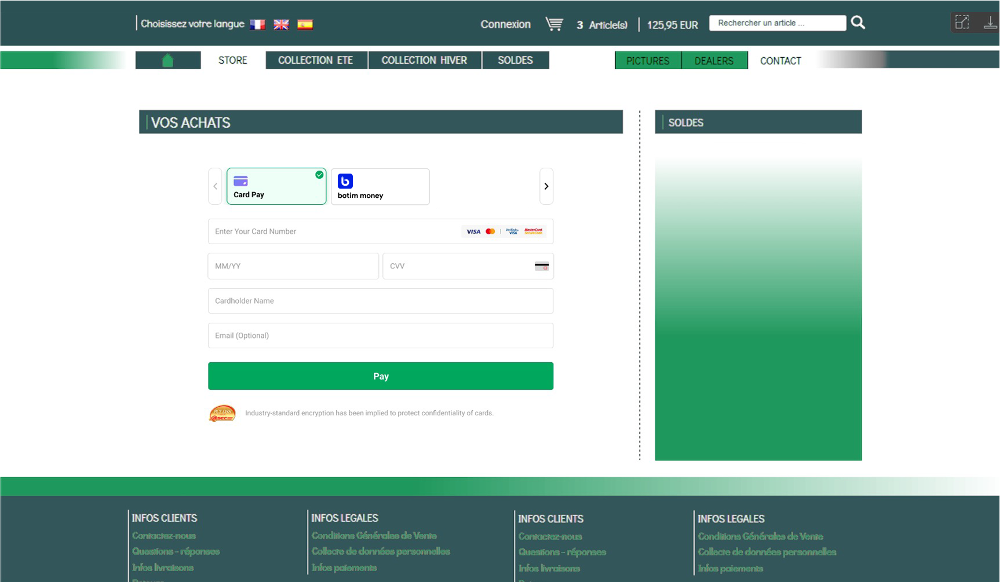
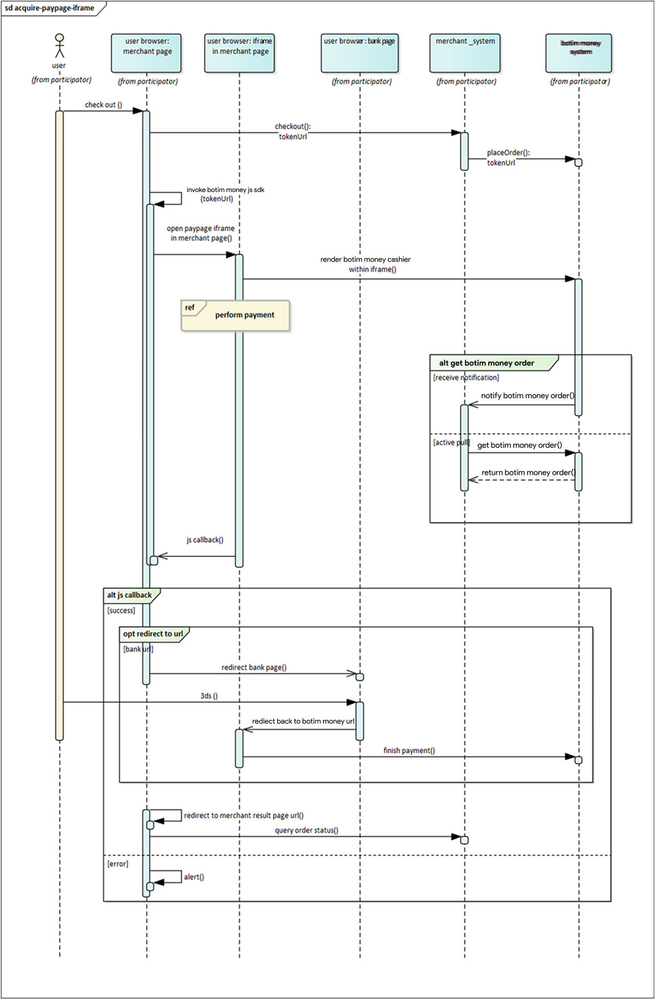

# iFrame Paypage

The iFrame Payment Page is a webpage prepared by Botim Money Business that can be embedded within your website. Although it resides on PayBy’s secure servers, the transition to the Botim Money Business secure page is invisible to the cardholder. 

Unlike the Hosted Paypage, using the iFrame Paypage ensures that customers remain on your website when making a payment, potentially reducing the payment failure rate. Additionally, integrating the iFrame Paypage within your site provides greater flexibility.

## User Experience

1. When customers are ready to complete their payment, your application creates a new order creation request.
2. The Botim Money Business returns a URL that can be rendered in the container on your checkout page.
3. Customers choose a payment method and enter their payment details on the payment page to complete the transaction.
4. If the payment is completed, customers will be redirected to the merchant's success page.

---



---


## Integrate the API

### Load Botim Money Business JS SDK

```
<script async src="https://checkout.payby.com/sdk/payby-sdk.umd.js"></script>
```

### Get `tokenUrl`

When the customer confirms to pay, call the [Create order](/docs/createorder) API, follow the API description to create a request. Pass `PAYPAGE` in the **paySceneCode** parameter.

If the request is successful, Botim Money Business will return a token url that can be rendered in the container on your checkout page.

---



---

### Create an iFrame

Use `PayBy.createIframe` with `tokenUrl` to create an iFrame within a predefined div element.

```
PayBy.createIframe({
  id: 'container',
  lang: 'ar',
  tokenUrl: tokenUrl,
  error: function (msg) {
   alert(msg); 
  }
 });
```

1. **Handling success Function**:
	- If the merchant passes a success function while creating the iFrame, the redirection will not happen automatically. Instead, the merchant can handle the result themselves.
	- The data parameter in the success function contains a JSON object with the payment result.
2. **Handling redirectURI**:
	- The redirectURI can either be a URL or a form.
	- If the redirectURI is a URL (starts with “https”), the merchant needs to redirect the user to that URL.
	- If the redirectURI is a form, it will contain an HTML form that needs to be rendered and submitted automatically. 	The form includes a script for auto-submission.
3. **3D Secure (3DS) Handling**: Merchants need to handle the 3DS verification themselves. The redirectURI will either lead to a 3DS verification link or contain a form that triggers the 3DS process.

When you create the iFrame using PayBy.createIframe, you can pass a success function to handle the payment result manually. The success function receives a data parameter that contains the payment result in JSON format.

```
window.PayBy.createIframe({
    id: 'paypage',
    tokenUrl: tokenUrl.value,
    success: function(data) {
        // Parse and handle the result
        var result = JSON.stringify(data);
        document.querySelector('#payment_result_message').innerText = result;
        document.querySelector('#payment_result_dialog').showModal();

        // Handle redirectURI
        var redirectURI = data.redirectURI;
        if (redirectURI.startsWith('https')) {
            window.location.href = redirectURI;
        } else {
            // Render and submit the form for 3DS
            var formHtml = redirectURI;
            document.body.innerHTML += formHtml;
            document.forms['frmBankID'].submit();
        }
    },
    error: function(err) {
        console.error('Payment failed:', err);
    }
});

```

## 3DS Verification Handling

- **URL Handling**: If redirectURI is a URL, redirect the user to this URL for 3DS verification.
- **Form Handling**: If redirectURI is an HTML form, render the form on your page and let it auto-submit for 3DS verification.

- **id**  
  - **Type:** `String`  
  - **Required:** ✅  
  - Defines the ID of the page element contained in the iFrame. You can name the ID using any recognizable characters.  
  - **Example value:** `container`  
  - **Max length:** `200`

- **lang**  
  - **Type:** `String`  
  - Specifies the default language of the Botim Money Business page returned in the `tokenUrl`.  
  - Supported values:  
    - `ar` — Arabic  
    - `en` — English  
  - If no value is passed, or an unsupported value is used, the default language will be English.

- **tokenUrl**  
  - **Type:** `String`  
  - **Required:** ✅  
  - The URL of the paypage to be rendered inside the container on your checkout page.

- **success**  
  - **Type:** `String`  
  >  ⚠️ **Deprecated**  
    This parameter is no longer in use.

- **error**  
  - **Type:** `Function`  
  - Handles failed payment processing within the iFrame.  
  - The merchant's website should display an error message based on the `msg` parameter in PayBy's response to inform the user of the specific issue.

### Redirect URL

Create a success page for the URL you provided in the **redirectUrl**  parameter to display order confirmation message to your customer. Botim Money Business will redirect the payer to this page after the payment has been completed on the checkout.

### Asynchronous Notification

If the **notifyUrl** is set in the order creation request, after the transaction, Botim Money Business will send payment result to the url.

### Change Order Status

You can initiate [Revoke](/docs/revoke), [Cancel](/docs/cancel), [Refund](/docs/refund) and other operations on the created order.

### Retrieve Order Detail

To retrieve the order detail, call the [Retrieve Order Detail](/docs/retrieveorderdetail) API.

## Set Payment Method

On the paypage, by default, all payment methods activated by the merchant in Botim Money Business will be listed. To adjust the order of payment methods or temporarily disable some payment methods for the payer, configure it in Payment Methods. [Payment Methods](https://b.botim.money/payment-methods).
