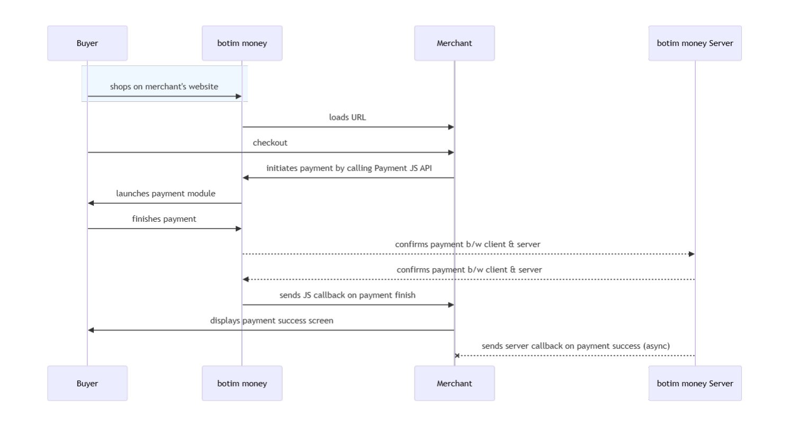

# JSAPI  

## Seamless Checkout via BOTIM & Botim Money Business Integration

For merchants with a mobile website, this payment scenario enables a smooth checkout experience directly within the BOTIM app. When a customer opens your webpage through a message in BOTIM, the built-in Botim Money Business checkout interface is automatically triggered, allowing the customer to complete their order and payment seamlessly.

This integration is especially beneficial if your customer base frequently uses the Botim Money Business or BOTIM apps. It simplifies the payment process by eliminating the need to design a custom checkout interface—merchants only need to invoke the Botim Money Business payment element, streamlining development and enhancing user convenience.

## User Experience

1.  The customer confirms to pay for an order, the merchant generates a QR codes on the interface.
2. The customer uses Botim Money Business, BOTIM to scan the QR code to obtain order information. 
3. In the order information returned by Botim Money Business server, there is a parameter **tokenUrl**, Botim Money Business or BOTIM application will parse this parameter and redirect the customer to the built-in checkout of the app.
4. Customers enter their payment details on the payment page and complete the transaction.
5. If the payment is completed, the customer will see the payment result on the app.

## Integrate the API

### Initiate Payment via Dynamic QR Code Using Botim Money Business

1. **Customer Confirmation**  
   Wait for the customer to confirm their intent to proceed with the payment.

2. **Create Order Request**  
   Call the [Create Order](/docs/createorder) API.  
   - Construct the request according to the API documentation.  
   - Set the `paySceneCode` parameter to `DYNQR`.

3. **Receive Token URL**  
   If the API request is successful, Botim Money Business will return a `tokenUrl`.

4. **Redirect to Built-in Checkout**  
   - The Botim Money Business or BOTIM app will parse the `tokenUrl`.  
   - The customer will be automatically redirected to the app’s built-in checkout interface to complete the payment.

5. **Payment Notification**  
   After the payment is completed:  
   - Botim Money Business will notify the result to either the Botim Money Business server or the BOTIM app.  
   - The customer will see the payment result displayed in the app.

### Asynchronous Notification

If the **notifyUrl** is set in the order creation request, after the transaction, Botim Money Business will send payment result to the url.

### Change Order Status

You can initiate [Revoke](/docs/revoke), [Cancel](/docs/cancel), [Refund](/docs/refund) and other operations on the created order.

### Retrieve Order

To retrieve the order detail, call the [Retrieve Order Detail](/docs/retrieveorderdetail) API.

