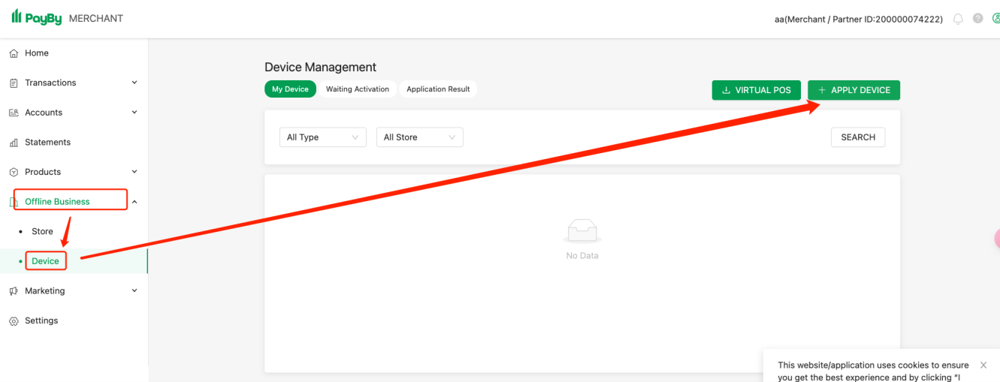
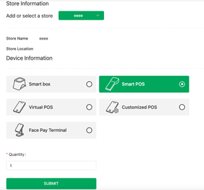
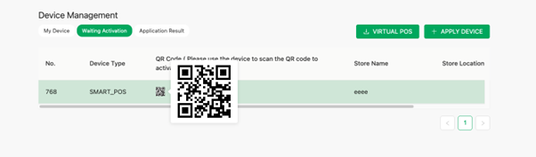
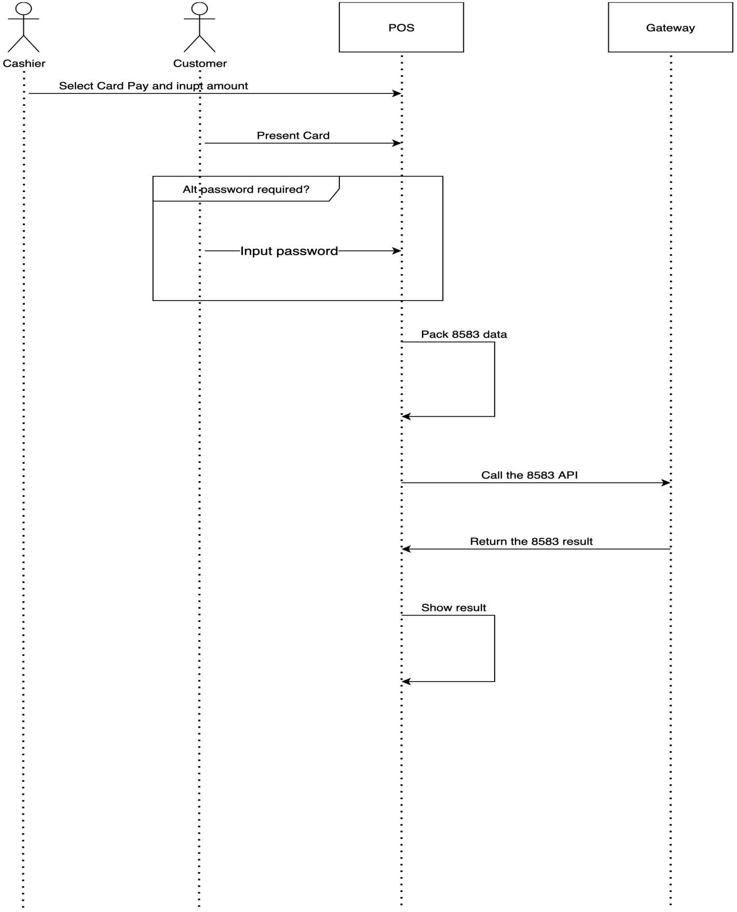
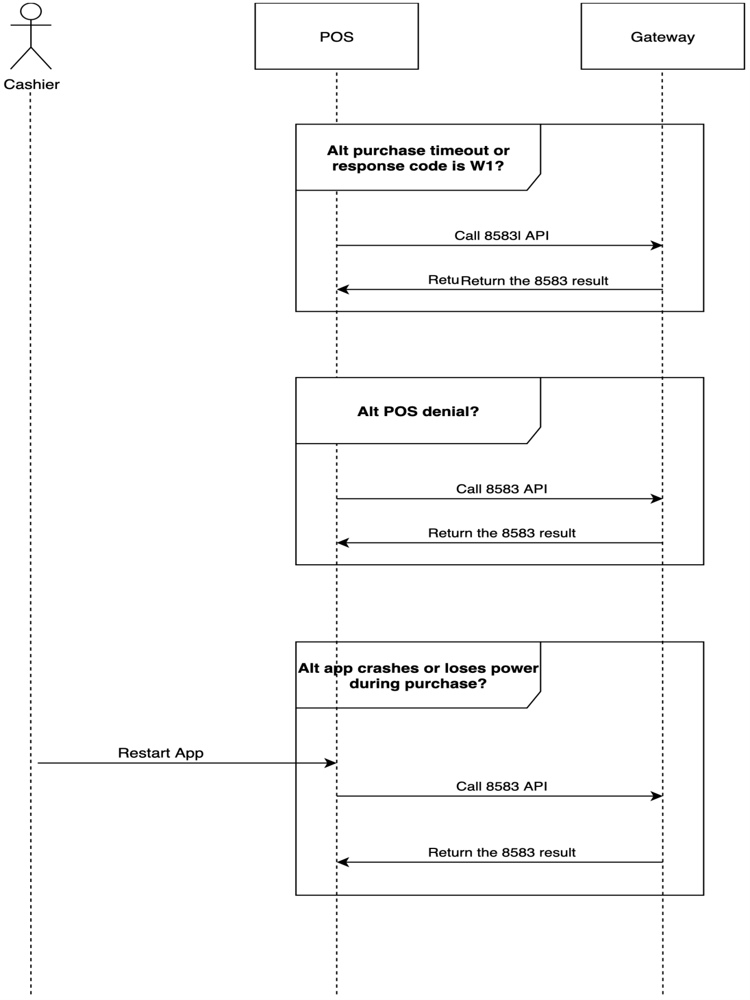
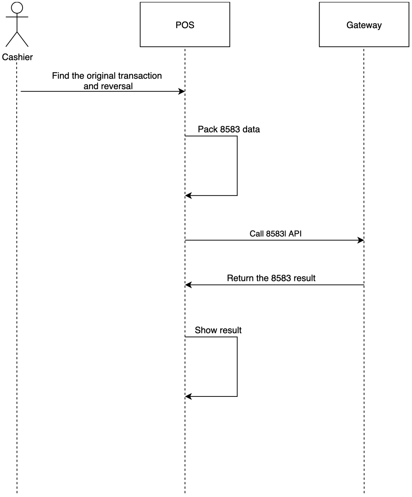
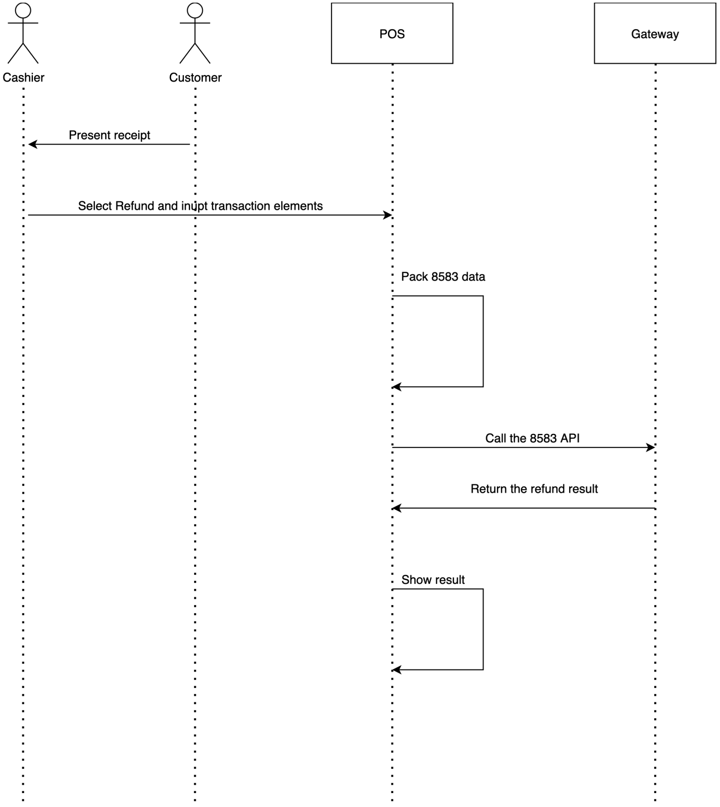

# 1. Introduction

- The **Gateway Terminal to Host Guide** is a comprehensive document designed to facilitate the integration of terminal devices with the Botim Money for Business (**BMB**) payment system. This guide is essential for merchants and developers who need to understand the detailed steps and API interactions required for seamless payment processing and device management.

  The following chapters are covered in this document:

  - **Protocol**: Establishes the foundation for merchant-gateway connectivity through RESTful API specifications, envelope packaging standards, and signature mechanisms ensuring secure communication channels.
  - **Device Registration Flow**: Guides users through the merchant console login process, device information registration, and the review workflow required for device activation approval.
  - **POS Device Activation Flow**: Covers device activation methods including QR code scanning and API-based activation, plus device information retrieval through the Device Info API.
  - **POS Transaction Flow**: Encompasses the complete payment lifecycle from order placement and bank card selection to payment processing, status inquiries, secondary authorization handling, and transaction result presentation.
  - **Business API**: Defines core entities (Device, Hardware, Merchant, Store) and transaction objects while providing comprehensive API specifications for device activation, order management, payment processing, and related operations.
  - **POS Error Codes**: Catalogs error classifications (general, server, activation, VOID, refund) with detailed descriptions, root causes, and recommended troubleshooting approaches for common issues.
  - **Receipt Format**: Establishes mandatory and optional receipt formatting standards for POS transactions, detailing field specifications, data sources, formatting rules, and transaction-specific handling requirements.
  - **POS Terminal Application Specification**: Defines the terminal application architecture with three-component messaging (TPDU, Message Header, ISO 8583), comprehensive data type definitions, and critical field specifications for entry modes, security controls, and private data management.
  - **Appendix**: Specifies PIN block calculation using ISO 9564-1 Format 0 with 3DES encryption, EMV tag requirements for different card schemes, and comprehensive response codes for transaction processing.

---

# 2. Protocol

> [!NOTE]
>
> In the interface specification tables introduced in the following chapters, the **"Mandatory"** column indicates whether a field or parameter is required or optional:
>
> - **M** stands for **Mandatory**, meaning the field is required.
> - **O** stands for **Optional**, meaning the field is not required.
> - **C** stands for **Conditional**, meaning the field appears in the message only under certain conditions. Please refer to the notes section for specific conditions.

## 2.1 Common Layer

The common layer covers RESTful API details, envelope packaging, and signature mechanisms to ensure secure and efficient communication.

- API URL: <https://uat.test2pay.com/pos-gateway/>
- Signature key type: RSA-2048

### 2.1.1 HTTP Parameters

- Method: POST
- HTTP Headers:
  - Content-Type: application/json
  - Accept: application/json, application/\*+json
  - Charset: UTF-8
  - Time Format: ISO8601 (e.g., yyyy-MM-dd'T'HH:mm:ss.SSSZ)
  

The outer envelope converts the secured content into a string and then sign it.

The recipient verifies the signature before decoding the content. This mechanism separates signing and verification from the business logic.

The parameters of the HTTP/HTTPS message body are as follows:

| Field| Type | Mandatory | Description |
|----|----|----|----|
| **issuer** | String | O | The issuer that initiates a request. |
| **content** | String | M | The content of the request. |
| **signature** | String | M | An alphanumeric string. |
| **signatureVersion** | String | M | The version of signature. For example, "1.0". |

### 2.2.1 issuer

| Field| Type | Mandatory | Description |
|----|----|----|----|
| **issuerCode** | String | M | The code of issuer. For example, "PP352719030008899". |
| **issuerType** | String | M | The type of issuer. For example, `POS_DEVICE` or `MEMBER`. |

## 2.2 Request

| Field | Type | Mandatory | Description |
|----|----|----|----|
| **header**     | JSON     | M             | The header of a request message. |
| **body**       | JSON     | O             | The body of a request message.   |

### 2.2.1 Header

| Field | Type | Mandatory | Description |
|----|----|----|----|
| **requestTime** | String | M | Refer to ISO 8601 specification for further information. |
| **service** | String | M | The name of the service API. |
| **serviceVersion** | String | M | The version of the service API. |

### 2.2.2 Body

The format of the request body is defined by business-specific requirements. Following this protocol, the request payload must be a hexadecimal-encoded string representing ISO 8583 data. The data structure consists of the **TPDU** (Transport Protocol Data Unit), followed by the message header, and then the data elements P0 through P63.

> [!TIP]
> 
> For comprehensive details regarding interface specifications and sample payloads, refer to the [Business API](#6-business-api) section.

### 2.2.3 Sample of Request

```json
{
    "header": {
        "requestTime":"2019-04-23T19:56:59.444+0800",
        "service":"plus",
        "serviceVersion":1.0
    },
    "body": {"iso8583":"600001000061010061000102203024068004C0881A2000000000000000010004082806000000000041313233343531303030303031393835303130303038323431303030323135362600000000000000006430303030303030303038353031303030383234313030303231303030303031393230323530383133313435333031313331373535363031393637373934303539001600000000000000000003303030"
            }}
```

> [!IMPORTANT]
> All data in the transaction message must comply with ISO 8583 specifications, maintaining uppercase format with no leading or trailing whitespace, and ensuring an even number of data elements. Please refer to the "body" section in the example code above.

## 2.3 Response

| Field | Type | Mandatory | Description |
|----|----|----|----|
| **header**     | JSON     | M             | The header of a response message. |
| **body**       | JSON     | O             | The body of a response message.   |

### 2.3.1 Header

| Field | Type | Mandatory | Description |
|----|----|----|----|
| **responseTime** | String | M | The timestamp of the response message. The format follows the ISO 8601 specification. |
| **responseCode** | String | M | The code that indicates the status of the response. It indicates success, errors, or other relevant statuses. |
| **errorMessage** | String | O | A detailed message describing any error that occurred, if applicable. |

### 2.3.2 Body

The format of the response body is defined by business-specific requirements. In accordance with this protocol, the response payload must be a hexadecimal-encoded string representing ISO 8583 data. The structure of the data comprises the TPDU (Transport Protocol Data Unit), followed by the message header, and the data elements P0 through P63.

### 2.3.3 Sample of Response

```json
{
    "header": {
        "requestTime": "2019-04-23T19:56:59.444+0800",
        "service": "plus",
        "serviceVersion": 1
    },
    "body": "{\"iso8583\":\"60000100006101006100010210703c02800ec080121641193900035587280000000000000010000001081242080909250500010074574b306c30504766374c79202020202020202030303031333235303030303230303030303334393039373738340064303030303030303030303030323030303030333439303937303030313332353032303235303930393132343230383133313735373430373332383034323232310003303030\"}"
}
```

---

# 3. Device Registration Flow

## 3.1. Login to Merchant Console

Access and log in to the merchant console at <https://uat-web-merchant.test2pay.com/login>.

<figure style="text-align: center; border: 1px solid #ccc; padding: 10px; width: fit-content;">
  
  <figcaption style="margin-top: 8px; font-weight: bold;">Merchant Console</figcaption>
</figure>

## 3.2. Add Device

In the console, add the device information for the device you want to integrate.

<figure style="text-align: center; border: 1px solid #ccc; padding: 10px; width: fit-content;">
  
  <figcaption style="margin-top: 8px; font-weight: bold;">Add Device</figcaption>
</figure>


## 3.3. Wait for Review

After you submit the device information, it will undergo a review process. Once the review is approved, the device will be ready for activation.

---

# 4. POS Device Activation Flow

## 4.1. Activation via QR Code Scan

Once the device information is submitted, it enters the review process. After the review is approved, the device becomes eligible for activation.

<figure style="text-align: center; border: 1px solid #ccc; padding: 10px; width: fit-content;">
  
  <figcaption style="margin-top: 8px; font-weight: bold;">Activate Device via QR Code</figcaption>
</figure>

> [!NOTE]
>
> Refer to [Device Activation](#62-device-activation).

## 4.2. Call Activation API

Complete device activation by calling the activation API.

> [!NOTE]
>
> Refer to [Device Activation](#62-device-activation).

## 4.3. Call Device Info API

> [!NOTE]
>
> Refer to [Get Device Info API](#63-get-device-info).

---

# 5. POS Transaction Flow

## 5.1 Purchase

The **Call Purchase** API is used to initiate bank card purchase transactions and concurrently retrieve the corresponding transaction results.

<figure style="text-align: center; border: 1px solid #ccc; padding: 10px; width: fit-content;">
  
  <figcaption style="margin-top: 8px; font-weight: bold;">Workflow of Calling Purchase API</figcaption>
</figure>
### 5.1.1 Transaction Processing Procedure

1. **Initiate Transaction**
   - The cashier enters the transaction details (e.g., amount, optional descriptions) into the POS terminal.

2. **Construct API Request**

   - The POS system prepares a request to the `/terminal-to-host/8583` endpoint, including all mandatory fields:
     - **Transaction elements as defined by the ISO 8583 protocol**.

3. **Transmit Request to POS Gateway**

   - **Endpoint URL**: `https://uat.test2pay.com/pos-gateway/`  
   - **Service Path**: `/terminal-to-host/8583`

4. **Handle API Response**

   - Upon a successful request, the response will contain:
     - **Transaction elements as defined by the ISO 8583 protocol**.

5. **Post-Transaction Handling by POS**

   - If the transaction is successful, the POS terminal prints a receipt. Refer to [Receipt Format](#8-receipt-format) for required receipt elements.
   - If the transaction fails, the POS displays an appropriate error message.
   - If an exception occurs, the POS initiates a reversal process.

> [!NOTE]
>
> The request and response body must be a hexadecimal-encoded string representing ISO 8583 data. The structure of the data must follow the format:
> **TPDU + Message Header + Data Elements P0–P63**
> For additional details, refer to the [Purchase](#64-purchase) section.

<div style="page-break-after: always;"></div>

## 5.2 Purchase Reversal

Calls the **Purchase Reversal** API to reverse the original purchase.

### 5.2.1 Scenario 1: Automatic Reversal

<figure style="text-align: center; border: 1px solid #ccc; padding: 10px; width: fit-content;">
  
  <figcaption style="margin-top: 8px; font-weight: bold;">Workflow of Automatic Reversal</figcaption>
</figure>
This workflow enables bank card transaction processing within a POS system by integrating with the */terminal-to-host/8583* API. For detailed procedural steps, refer to the section below.

#### 5.2.1.1 Automatic Reversal Transaction Procedure

1. **Invoke the 8583 API**

   - **Endpoint URL**: `https://uat.test2pay.com/pos-gateway/`  
   - **Service Path**: `/terminal-to-host/8583`  
   - **Purpose**: To initiate a reversal of the original purchase transaction.

2. **Construct API Request**

   - The POS system constructs a request to the `/terminal-to-host/8583` endpoint, including all mandatory fields:
     - **Transaction elements as defined by the ISO 8583 protocol**.

3. **Transmit Request to POS Gateway**

   - **Endpoint URL**: `https://uat.test2pay.com/pos-gateway/`  
   - **Service Path**: `/terminal-to-host/8583`

4. **Handle API Response**

   - Upon a successful request, the response will contain:
     - **Transaction elements as defined by the ISO 8583 protocol**.
     - In this scenario, response codes **00**, **12**, and **25** are all considered indicators of a successful reversal.

<div style="page-break-after: always;"></div>

### 5.2.2 Scenario 2: Manual Reversal

<figure style="text-align: center; border: 1px solid #ccc; padding: 10px; width: fit-content;">
  
  <figcaption style="margin-top: 8px; font-weight: bold;">Workflow of Manual Reversal</figcaption>
</figure>
This workflow enables bank card transaction processing within a POS system through integration with the */terminal-to-host/8583* API. For detailed procedural steps, refer to the section below.

#### 5.2.2.1 Manual Reversal Transaction Procedure

1. **Initiate Transaction**

   - The cashier enters the trace number into the POS terminal to locate the original purchase transaction.
   - The original transaction is retrieved from the transaction list.
   - **Transaction data must be stored in the terminal's local database. A recommended retention period is 180 days.**

2. **Construct API Request**

   - The POS system prepares a request to the `/terminal-to-host/8583` endpoint, including all mandatory fields:
     - **Transaction elements as defined by the ISO 8583 protocol**.

3. **Transmit Request to POS Gateway**

   - **Endpoint URL**: `https://uat.test2pay.com/pos-gateway/`  
   - **Service Path**: `/terminal-to-host/8583`

4. **Handle API Response**

   - Upon a successful request, the response will contain:
     - **Transaction elements as defined by the ISO 8583 protocol**.

5. **Post-Transaction Handling by POS**

   - If the transaction is successful, the POS terminal prints a receipt. Refer to [Receipt Format](#8-receipt-format) section for required receipt elements.
   - If the transaction fails, the POS displays an appropriate error message.

> [!NOTE]
>
> The request and response body must be a hexadecimal-encoded string representing ISO 8583 data. The structure of the data must follow the format: 
> **TPDU + Message Header + Data Elements P0–P63**
> For additional details, refer to the [Purchase Reversal](#65-purchase-reversal) section.

<div style="page-break-after: always;"></div>

## 5.3 Refund

Calls the **Refund** API to perform refund operations.

<figure style="text-align: center; border: 1px solid #ccc; padding: 10px; width: fit-content;">
  
  <figcaption style="margin-top: 8px; font-weight: bold;">Workflow of Refund</figcaption>
</figure>

This workflow enables bank card refund processing within a POS system through integration with the */terminal-to-host/8583* API.

### 5.3.1 Refund Transaction Procedure

1. **Initiate Transaction**
   - The cashier enters the transaction details into the POS terminal, including:
     - Amount  
     - Original transaction date  
     - POS center unique identifier (field 60.4)

2. **Construct API Request**
   - The POS system prepares a request to the `/terminal-to-host/8583` endpoint, including all mandatory fields:
     - **Transaction elements as defined by the ISO 8583 protocol**
   
3. **Transmit Request to POS Gateway**

   - **Endpoint URL**: `https://uat.test2pay.com/pos-gateway/`  
   - **Service Path**: `/terminal-to-host/8583`

4. **Handle API Response**

   - Upon a successful request, the response will contain:
     - **Transaction elements as defined by the ISO 8583 protocol**

5. **Post-Transaction Handling by POS**

   - If the transaction is successful, the POS terminal prints a receipt. Refer to [Receipt Format](#8-receipt-format) section for required receipt elements.
   - If the transaction fails, the POS displays an appropriate error message.

> [!NOTE]
>
> The request and response body must be a hexadecimal-encoded string representing ISO 8583 data. The structure of the data must follow the format:  
> **TPDU + Message Header + Data Elements P0–P63**
> For additional details, refer to the [Refund](#66-refund) section.

---

# 6. Business API

## 6.1 Common Definitions

### 6.1.1 Device

| Field | Type | Mandatory | Description |
|----|----|----|----|
| **deviceId** | String | M | The unique identifier for the device. |
| **name** | String | O | The name assigned to the device. |
| **status** | String | M | The status of the device (ENABLE / DISABLE). |
| **createdTime** | String | M | The timestamp when the order was created, formatted according to ISO 8601 specification (e.g., `2022-02-07T12:38:16.897+04:00`). |
| **deviceChannelList** | String arrays | O | A list of channels associated with the device. |
| **storeId** | String | O | The unique identifier for the store where the device is located. |
| **merchantMid** | String | O | The unique identifier for the merchant. |
| **type** | String | O | The type of device. |
| **lastReportGpTime** | Date | O | The timestamp of the last update from the device. |
| **tipsType** | String | O | The type of tips allowed by the device. |
| **tipsMaxAmount** | Money | O | The maximum amount for tips allowed by the device. |
| **tipsMaxRate** | Double | O | The maximum rate for tips allowed by the device. |
| **tipsChannelCode** | String | O | The code for the tips channel. |

### 6.1.2 Hardware

| Field | Type | Mandatory | Description |
|----|----|----|----|
| **snNumber** | String | M | The serial number of the hardware, which uniquely identifies the device. |
| **type** | String | M | The type or model of the hardware. |
| **factory** | String | O | The name of the factory where the hardware was manufactured. |
| **createdTime** | String | M | The timestamp when the hardware was created, formatted according to ISO 8601 specification (e.g., `2022-02-07T12:38:16.897+04:00`). |

### 6.1.3 Merchant

| Field | Type | Mandatory | Description |
|----|----|----|----|
| **status** | String | M | Indicates the status of the merchant. Options: "ENABLE" and "DISABLE". |
| **name** | String | M | The name of the merchant. |
| **licencePhotoPath** | String | O | The file path to the merchant's license photo. |
| **contactName** | String | M | The name of the primary contact person for the merchant. |
| **contactMobile** | String | M | The mobile phone number of the primary contact person for the merchant. |
| **contactEmail** | String | O | The email address of the primary contact person for the merchant. |
| **mid** | String | M | The unique member ID assigned to the merchant by BMB. |
| **category** | String | O | The merchant category code (MCC). |

### 6.1.4 Store

| Field | Type | Mandatory | Description |
|----|----|----|----|
| **name** | String | M | The name of the store. |
| **location** | String | M | The location or address of the store. |
| **storeEntrancePhotoPath** | String | O | The file path to the photo of the store entrance. |
| **cashDeskPhotoPath** | String | O | The file path to the photo of the cash desk area. |
| **eatmSwitch** | String | M | Indicates whether the EATM (Electronic Automated Teller Machine) feature is enabled or disabled. Options: "OFF" and "ON". |

### 6.1.5 SecondaryStore

| Field | Type | Mandatory | Description |
|----|----|----|----|
| **secondaryStoreNo** | String | M | The unique identifier assigned to a secondary store. |
| **merchantMid** | String | M | The unique member ID of the merchant associated with the secondary store. |
| **name** | String | O | The name of the secondary store. |
| **address** | String | O | The physical address of the secondary store. |

### 6.1.6 SecondaryMerchantDetail

| Field | Type | Mandatory | Description |
|----|----|----|----|
| **id** | String | O | The unique identifier for the secondary merchant. |
| **mcc** | String | O | The merchant category code (MCC) for the secondary merchant. |
| **name** | String | O | The name of the secondary merchant. |
| **innerId** | Long | O | The internal identifier for the secondary merchant. |

### 6.1.7 Money

| Field | Type | Mandatory | Description |
|----|----|----|----|
| **currency** | String | M | The currency code following the ISO 4217 specification. |
| **amount** | BigDecimal | M | The monetary amount represented as a string to accommodate arbitrary precision decimals, e.g., '1.00'. |

### 6.1.8 PaymentOrder

| Field | Type | Mandatory | Description |
|----|----|----|----|
| **id** | String | M | The unique identifier for the transaction. |
| **extensions** | Map | O | Additional information related to the transaction. |
| **status** | String | M | The status of the transaction. |
| **paidTime** | String | O | The time when the transaction was paid. |
| **payMethod** | String | O | The method of payment used for the transaction. Options: `PHYSICAL_CARD_PAY` and `APP`. |

### 6.1.9 AmountDetail

| Field | Type | Mandatory | Description |
|----|----|----|----|
| **discountableAmount** | Money | O | The amount of discounts. |
| **amount** | Money | O | Since Protobuf does not support arbitrary precision decimals, a string is used, e.g., '1.00'. |
| **vatAmount** | Money | O | The amount of Value Added Tax (**VAT**). |
| **tipAmount** | Money | O | The amount of tips. |

> [!NOTE]
> 
> Parameters in this section inherit the data type of parameter `amount` of [Money](#617-money).

### 6.1.10 TerminalDetail

| Field | Type | Mandatory | Description |
|----|----|----|----|
| **operatorId** | String | O | The unique identifier for the operator. |
| **storeId** | String | O | The unique identifier for the store. |
| **terminalId** | String | O | The unique identifier for the terminal. |
| **merchantName** | String | O | The name of the merchant. |
| **storeName** | String | O | The name of the store. |
| **location** | String | O | The location or address of the store. |

### 6.1.11 posReceipt

| Field | Type | Mandatory | Description |
|----|----|----|----|
| **posMerchantName** | String | O | The name of the merchant as it appears on the receipt. |
| **posMerchantAddr1** | String | O | The first line of the merchant's address. |
| **posMerchantAddr2** | String | O | The second line of the merchant's address. |
| **logo** | String | O | The URL or file path to the merchant's logo image. |
| **merchantMid** | String | O | The unique merchant identifier. |

### 6.1.12 AmexMidMapping

| Field | Type | Mandatory | Description |
|----|----|----|----|
| **mid** | String | O | The general merchant identifier for the POS device. |
| **amexMid** | String | O | The unique American Express merchant identifier. |

## 6.2 Device Activation

Activates the device.

- URL: <https://uat.test2pay.com/pos-gateway/device.do/>
- serviceName: *active*

### 6.2.1 Request

| Field | Type     | Mandatory | Description |
|----------------|----------|-----------|-------------|
| code           | String   | M         | The activation code provided by the portal. |
| pubKey         | String   | M         | The RSA public key encoded as a Base64 string. |
| posDeviceType  | String   | M         | The type of POS device. Options:<br/>- `SMART_POS`. The default value<br/>- `VIRTUAL_POS`<br/>- `CUSTOMIZED_VPOS`<br/>- `FACE_PAY_TERMINAL` |

> [!TIP]
>
> To activate a POS device, you can scan the QR code or use the string corresponding to the QR code to complete the device activation.

### 6.2.2 Sample of Request

```json
{
    "issuerCode": "WCHG031903001566",
    "signature": "745b6bb447aa75c1299ebdfee6168c99779a9590a51701021e71def6bbad79d851cdf6a668b25c6acd562387aba8c78b0df63b9ac75aa32ade7f52070d68266d4823e7a82358e0d9e0364a189581c78f9944bd50d988cef6a2d8ca8b62468e51f64088557ef687334344f49e965e9586b4b7f435deb95a6862963b38ae3d472dd221c4d1e03f7f47e60219cfad4b8574028e14a5dcbd77a4c843a55e49ea11794f3ac2086e7c1eb7b82c8bf69ec870e14d46f6c2729fc9582eade6b8531d76747ce2ae00982ae388d9ad856d386b00073c1d1b1bd3817eed6e5710835a31f87f9a88d59122f05b61208b4bc983b6baf92f81ae994a3a07f593cb1ee272596de6",
    "signatureVersion": 1.0,
    "content": "{\"header\":{\"requestTime\":\"2019-12-22T15:14:26.383+0800\",\"service\":\"active\",\"serviceVersion\":1.0},\"body\":{\"code\":\"dGVzdDExMTE=\",\"pubKey\":\"-----BEGIN PUBLIC KEY-----\\r\\nMIIBIjANBgkqhkiG9w0BAQEFAAOCAQ8AMIIBCgKCAQEAsOOPoVMnzD+1yzA/j5Nr\\r\\nNRba/P34VNLovjWMWGI4D+K0eUbh8DfVcAHS/ro2wnV4MSZ9X8dKOfKK3xl2LWH1\\r\\nbcqOMCdtIaIqid2tzdpQKaQnPIpeVZnPMTJicsl8voLFeBgxMbP7cqVzQV+DyEkr\\r\\nLwlk6nTwJvfQdwv8IMIxeoHFzoIuCF+s+MgWXkT/qyLmC7p7dcW7kv33d/Q6VMCQ\\r\\n3Gp48bv0jKNHtd9gTqUfhWKkxVf0DMC6RqvcD0oo6pdB+F5EvkR4dkhvaTgiVxS+\\r\\nfGQqHGPSXkoazBJyd7TpMiC6q2DjJU2tgKdVeOedsEUusZ82XQfYxDjY7XK16hds\\r\\n0wIDAQAB\\r\\n-----END PUBLIC KEY-----\"}}"
}
```

### 6.2.3 Sample of Response

```json
{
    "header": {
        "responseTime": "2025-01-27T10:58:25.577+08:00",
        "responseCode": "SUCCESS"
    }
}
```

## 6.3 Get Device Info

Calls the *getDeviceInfo* API to retrieve the device configuration information.

- URL: [https://uat.test2pay.com/pos-gateway/](https://uat.test2pay.com/pos-gateway/device.do/)
- serviceName: *getDeviceInfo*
- Request: None

### 6.3.1 Response

| Field | Type              | Mandatory | Description |
|--------------------|-------------------|-----------|-------------|
| device             | Device            | M         | The device information. See also: [Device](#611-device). |
| hardware           | Hardware          | M         | The hardware information. See also: [Hardware](#612-hardware). |
| merchant           | Merchant          | M         | The merchant information. See also: [Merchant](#613-merchant). |
| store              | Store             | M         | The store information. See also: [Store](#614-store). |
| roleList           | Role arrays       | O         | A list of roles, including `name` and `accessMenuList`. |
| staffList          | Staff arrays      | O         | A list of staff information, including `id`, `name`, `password`, and `role`. |
| secondaryStore     | SecondaryStore    | O         | See also: [SecondaryStore](#615-secondarystore). |
| needPassword       | map               | O         | The configuration values in `needPassword` determine which operations require a password to be executed. |
| terminalSetupList  | TerminalSetup     | O         | A list that defines configuration parameters Mandatory to initialize or communicate with a POS device. It contains two parameters:<br/>- `pKey`: A unique ID that defines what is being configured.<br/>- `pValue`: The value assigned to pKey, indicating how the parameter specified in `pKey` is configured. |
| posReceipt         | PosReceipt        | O         | The receipt from the POS device. For details, refer to [posReceipt](#6111-posreceipt). |
| amexMidMapping     | AmexMidMapping    | O         | The configuration feature used in POS (Point of Sale) devices to associate a merchant's general identifier (mid) with their specific American Express identifier (`amexMid`). <br/>This mapping ensures that transactions made with American Express cards are properly routed and identified for the respective merchant. <br/>For details, refer to [AmexMidMapping](#6112-amexmidmapping). |

Sample of `roleList`:

```json
"roleList": [
    {
        "name": "Manager",
        "accessMenuList": ["Refund", "Void", "Pre Auth Completion VOID", "Settings"]
    },
    {
        "name": "Supervisor",
        "accessMenuList": ["Refund", "Void", "Settings"]
    },
    {
        "name": "Operator"
    }
]
```

Sample of `staffList`:


```json
"staffList": [
    {
        "id": 1,
        "name": "Manager",
        "password": "11111",
        "role": "Manager"
    },
    {
        "id": 2,
        "name": "Supervisor",
        "password": "08520",
        "role": "Supervisor"
    }
]
```

Sample of `needPassword`:

```json
"needPassword": {
    "EATM": false,
    "EATM_CashIn": false,
    "EATM_CashOut": false,
    "GoCredit": false,
    "History": false,
    "Pre_Auth": false,
    "PreAuth": false,
    "PACancel": false,
    "PACompletion": false,
    "PACompletionVOID": true,
    "PrintReport": false,
    "Purchase": false,
    "Purchase_DCC": false,
    "Purchase_PayBy": false,
    "TipsT1": false,
    "TipsT2": false,
    "Purchase_ADCBNI": false,
    "Redeem_Voucher": false,
    "Refund": true,
    "Send_Paylink": false,
    "Settings": true,
    "Void": true
}
```

Sample of `terminalSetupList`:

```json
"terminalSetupList": [
    {
        "pkey": "POS_TimeOut",
        "pvalue": "[{\"timeOutSec\":\"60\",\"channelCode\":\"PayBy_BOTIM\"}, {\"timeOutSec\":\"60\",\"channelCode\":\"ADCB_NI\"}, {\"timeOutSec\":\"60\",\"channelCode\":\"ADCB_FISERV\"}]"
    }
]
```

### 6.3.2 Sample of Response

```json
{
    "header": {
        "responseTime": "2025-03-04T10:12:10.766+0000",
        "responseCode": "SUCCESS",
        "errorMessage": null,
        "preserved": null,
        "traceCode": null
    },
    "body": {
        "device": {
            "deviceId": "13212",
            "name": null,
            "status": "ENABLE",
            "createdTime": "2025-02-27T06:28:46.000+0000",
            "extParams": {
                "EATM_CashIn": "{\"display\":\"false\",\"status\":\"Active\"}",
                "PACompletion": "{\"display\":\"false\",\"status\":\"Inactive\"}",
                "History": "{\"display\":\"true\",\"status\":\"Active\"}",
                "Purchase_PayBy": "{\"display\":\"true\",\"status\":\"Active\"}",
                "Pre_Auth": "{\"display\":\"false\",\"status\":\"Inactive\"}",
                "Purchase_ADCBNI": "{\"display\":\"false\",\"status\":\"Inactive\"}",
                "Void": "{\"display\":\"true\",\"status\":\"Active\"}",
                "Settings": "{\"display\":\"true\",\"status\":\"Active\"}",
                "PreAuth": "{\"display\":\"false\",\"status\":\"Inactive\"}",
                "PrintReport": "{\"display\":\"true\",\"status\":\"Active\"}",
                "Purchase": "{\"display\":\"true\",\"status\":\"Active\"}",
                "Purchase_DCC": "{\"display\":\"false\",\"status\":\"Inactive\"}",
                "Redeem_Voucher": "{\"display\":\"false\",\"status\":\"Active\"}",
                "TipsT2": "{\"display\":\"false\",\"status\":\"Inactive\"}",
                "TipsT1": "{\"display\":\"false\",\"status\":\"Inactive\"}",
                "OperatorEnabled": "{\"display\":\"true\",\"status\":\"Inactive\"}",
                "Send_Paylink": "{\"display\":\"true\",\"status\":\"Active\"}",
                "KLIP": "{\"display\":\"false\",\"status\":\"Inactive\"}",
                "PACompletionVOID": "{\"display\":\"false\",\"status\":\"Inactive\"}",
                "Batch_Closure": "{\"display\":\"false\",\"status\":\"Inactive\"}",
                "EATM_CashOut": "{\"display\":\"false\",\"status\":\"Active\"}",
                "ADCB_FISERV": "{\"display\":\"false\",\"status\":\"Inactive\"}",
                "GoCredit": "{\"display\":\"false\",\"status\":\"Inactive\"}",
                "Refund": "{\"display\":\"false\",\"status\":\"Active\"}",
                "EATM": "{\"display\":\"false\",\"status\":\"Active\"}",
                "ecr_mode": "{\"display\":\"true\",\"status\":\"Inactive\"}",
                "PACancel": "{\"display\":\"false\",\"status\":\"Inactive\"}"
            },
            "deviceChannelList": null,
            "storeId": "347",
            "merchantMid": "200000030906",
            "type": "SMART_POS",
            "lastReportGpTime": null,
            "tipsType": null,
            "tipsMaxAmount": null,
            "tipsMaxRate": null,
            "tipsChannelCode": null
        },
        "hardware": {
            "snNumber": "PB16208N60999",
            "type": "SMART_POS",
            "factory": null,
            "createdTime": "2025-02-27T06:28:46.000+0000"
        },
        "merchant": {
            "status": "ENABLED",
            "name": "regress6666",
            "licencePhotoPath": "20200402/1585809750134.png",
            "contactName": "wangcan11",
            "contactMobile": "+971-585920614",
            "contactEmail": "can.wang@payby.com",
            "mid": "200000030906",
            "category": "9223"
        },
        "store": {
            "name": "Silver Tower",
            "location": "Abu Dhabi - Zone 1E5 - Abu Dhabi - United Arab Emirates",
            "storeEntrancePhotoPath": "20201014/1602681361943.png",
            "cashDeskPhotoPath": "20201014/1602681365232.png",
            "eatmSwitch": "OFF"
        },
        "staffList": [{
            "name": "Manager",
            "status": "DISABLED",
            "id": 4,
            "password": "11111",
            "role": "Manager"
        }, {
            "name": "Supervisor",
            "status": "DISABLED",
            "id": 5,
            "password": "08520",
            "role": "Supervisor"
        }, {
            "name": "Operator",
            "status": "ENABLED",
            "id": 6,
            "password": "00000",
            "role": "Operator"
        }, {
            "name": "Keke",
            "status": "DISABLED",
            "id": 14,
            "password": "132580",
            "role": "Shopkeeper VIP"
        }, {
            "name": "Mingliang Zuo",
            "status": "DISABLED",
            "id": 16,
            "password": "121121",
            "role": "Shopkeeper VIP"
        }, {
            "name": "shopkeeper",
            "status": "ENABLED",
            "id": 23,
            "password": "111111",
            "role": null
        }],
        "roleList": [{
            "name": "Manager",
            "accessMenuList": ["Batch_Closure", "History", "Refund", "Settings", "Void"],
            "id": 4
        }, {
            "name": "Operator",
            "accessMenuList": ["Refund"],
            "id": 6
        }, {
            "name": "Shopkeeper VIP",
            "accessMenuList": ["Batch_Closure", "History", "Refund", "Settings", "Void"],
            "id": 11
        }, {
            "name": "Supervisor",
            "accessMenuList": ["Refund", "Void", "Settings"],
            "id": 5
        }],
        "secondaryStore": null,
        "needPassword": {
            "Purchase": false,
            "PrintReport": false,
            "PreAuth": false,
            "Redeem_Voucher": false,
            "TipsT2": false,
            "EATM_CashIn": false,
            "PACompletion": false,
            "Send_Paylink": false,
            "PACompletionVOID": false,
            "History": true,
            "EATM_CashOut": false,
            "Batch_Closure": true,
            "Purchase_PayBy": false,
            "GoCredit": false,
            "Pre_Auth": false,
            "Refund": true,
            "EATM": false,
            "Purchase_ADCBNI": false,
            "PACancel": false,
            "Void": true,
            "Settings": true
        },
        "terminalSetupList": [{
            "pkey": "POS_TimeOut",
            "pvalue": "[{\"timeOutSec\":\"60\",\"channelCode\":\"PayBy_BOTIM\"},{\"timeOutSec\":\"60\",\"channelCode\":\"ADCB_NI\"},{\"timeOutSec\":\"60\",\"channelCode\":\"ADCB_FISERV\"}]"
        }, {
            "pkey": "device_data_reporting",
            "pvalue": "wifi_only"
        }],
        "posReceipt": null,
        "amexMidMapping": null
    }
}
```

## 6.4 Purchase

Enables POS terminals to process bank card payment transactions by sending ISO 8583 formatted messages containing card data, transaction amounts, and terminal information to complete payment authorization and settlement.

### 6.4.1 Purchase Transaction Message Fields

| Bit | Field Name | Attribute | Format | Type | Request | Response | Notes |
|---|---|---|---|---|---|---|---|
|  | Message Type | N4 |  | BCD | 0200 | 0210 | MSG-TYPE-ID |
|  | Bitmap | B64 |  | BINARY | M | M | BIT MAP |
| 2 | Primary Account Number | n..19 | LLVAR | BCD | C | C | Usage 1: Mandatory when Field 22 indicates non-magnetic input method and the card number can be identified.<br/><br/>Usage 2: Mandatory when card number is manually keyed in by the operator. |
| 3 | Processing Code | N6 |  | BCD | M | M | 000000 |
| 4 | Transaction Amount | N12 |  | BCD | M | M | Terminal maximum input amount 99999999.99 |
| 6 | Cardholder Billing Amount | N12 |  | BCD | C | C | Mandatory for DCC transactions |
| 10 | Cardholder Billing Conversion Rate | N8 |  | BCD | C | C | Mandatory for DCC transactions |
| 11 | System Trace Audit Number | N6 |  | BCD | M | M | POS terminal transaction sequence number |
| 12 | Local Transaction Time | N6 | hhmmss | BCD |  | M |  |
| 13 | Local Transaction Date | N4 | MMDD | BCD |  | M |  |
| 14 | Card Expiration Date | N4 | YYMM | BCD | C1 | C2 | C1: Present when POS can determine;<br/><br/>C2: Present for cards with expiration date |
| 22 | Point of Service Entry Mode | N3 |  | BCD | M |  |  |
| 23 | Card Sequence Number | n3 |  | BCD | C | C | C: Present when POS can obtain this value |
| 25 | Point of Service Condition Code | N2 |  | BCD | M | M | 00 |
| 26 | Point of Service PIN Capture Code | n2 |  | BCD | C |  | Field 22 indicates PIN input capability and cardholder entered PIN, value range 4-12 |
| 35 | Track 2 Data | z..37 | LLVAR | BCD | C |  | Must appear when bank card is present and track 2 information exists |
| 37 | Retrieval Reference Number | An12 |  | ASCII |  | M | POS center system sequence number |
| 38 | Authorization Identification Response | an6 |  | ASCII |  | C | Defined by issuing bank when transaction is approved |
| 39 | Response Code | an2 |  | ASCII |  | M |  |
| 41 | Card Acceptor Terminal Identification | ans8 |  | ASCII | M | M | Terminal code |
| 42 | Card Acceptor Identification Code | ans15 |  | ASCII | M | M | Merchant code |
| 48 | Additional Data - Private Use | an…512 | LLLVAR | ASCII | C |  | Mandatory when using DUKPT. Refer to [Usage 1](#9322-usage-transaction-ksn).|
| 49 | Transaction Currency Code | an3 |  | ASCII | M | M |  |
| 51 | Cardholder Billing Currency Code | an3 |  | ASCII | C | C | Mandatory for DCC transactions |
| 52 | Personal Identification Number Data | B64 |  | BINARY | C |  | Present when using online PIN verification and PIN is entered |
| 53 | Security Related Control Information | N16 |  | BCD | C | C | Mandatory when security requirements exist or magnetic stripe information is present |
| 54 | Additional Amounts | n…12 | LLLVAR | ASCII | C |  | Mandatory when tip is entered |
| 55 | Integrated Circuit Card System Related Data | Maximum 255 bytes | LLLVAR | Contains multiple sub-fields | C | C | Mandatory for EMV transactions. See [Field 55](#102-field-55-emv-tag-specification). |
| 59 | Custom Field | Ans…999 | LLLVAR | Contains multiple sub-fields | C |  | This field is in TLV format, sub-fields defined as follows |
| TagA1 | Terminal Geographic Location Information | ans…256 | VAR | ASCII | C |  | Mobile acceptance terminal, upload terminal geographic location for purchase and pre-authorization transactions |
| 60 | Custom Field | ans…512 | LLLVAR | ASCII | M | M |  |
| 60.1 | Batch Number | n6 |  | ASCII | M | M | Fill with 000000 when terminal does not use batch number management |
| 60.2 | Network Management Information Code | n3 |  | ASCII | C | C | Fill with default value 000 |
| 60.3 | Transaction Request Unique Identifier | an37 |  | ASCII | C |  | Present when terminal does not use batch number management, format: field 42 + field 41 + yyyyMMddHHmmss |
| 60.4 | POS Center Unique Identifier | an18 |  | ASCII |  | M |  |
| 62 | Custom Field | ans…072 | LLLVAR | ASCII | C | C | *This field is reserved for installment payment scenarios.* |
| 63 | Custom Field | ans...063 | LLLVAR | ASCII |  | M |  |
| 63.1 | International Credit Card Company Code | an3 |  | ASCII |  | M | Fill with all zeros if none |


> [!NOTE]
>
> For further information on ICC tags, refer to: [Complete list of EMV & NFC tags \| EMV.COOL](https://emv.cool/2020/12/23/Complete-list-of-EMV-NFC-tags/).

### 6.4.2 Sample of Request

```json
{
  "issuer": {
    "issuerCode": "P31724AJJ0467",
    "issuerType": "SMART_POS"
  },
  "content": "{\"body\":{\"iso8583\":\"600001000061010061000102007024068020C0823016557652660531887900000000000000990000000429110720000000375576526605318879D2911221000001670020003030303031323236303030323030303030303836323135373834019750104465626974204D617374657263617264820219808407A0000000041010950500000080019A032602069C01005F2A0207845F3401009F02060000000099009F03060000000000009F080200029F090200029F0D05B4508400009F0E0500000000009F0F05B4708480009F10120110A04001220000000000000000000000FF9F1A0207849F1E0830303030303930359F260879DD1CAAA8CF50539F2701809F3303E008E89F34031F03029F3501229F3602025A9F3704937F3EF09F6E070784000030300000334131303238303131302B32342E343935383131303231302B35342E343038353431004630303030303030303030303032303030303030383632313530303030313232363230323630323036313632303033\"},\"header\":{\"service\":\"/terminal-to-host/8583\",\"serviceVersion\":\"2.0\",\"requestTime\":\"2026-02-06T16:20:03.719+04:00\"}}",
  "signature": "73b778da7c33ac1b7308a7e618166bed3668197d9ee0c741bc104b6284738499d8cf8ea220c2ac75f629217c9a7e625694e7756d90fbebae838a3fdf682513ce7b4c884393df3b79005657c8cd43072d3a6ea178d92c929500d868ded85782f43cdf18f430162f83783617047e7f6878c15aacd5348c62ba8e5eb4f7796bc410e5b9df5ea5df950d4f87031624e066a14080195382ea19a9b9f6d9624cc3e1ffa3233c572e570a3722d6f28bee49ddcc8912209de5d471a1b987d3bb44640747f7fb0b19830da59d22b09b31b7d5a5fbb67f0da0945bb7401ced7675bbc61fda1f7afbb6e9c50e9b6d482a8d0c663294c94c563afc5bf3bc55b064e511150e78",
  "signatureVersion": "2.0"
}
```

### 6.4.3 Sample of Response

```json
{
  "header": {
    "responseTime": "2026-02-06T12:20:04.587+0000",
    "responseCode": "SUCCESS",
    "errorMessage": null,
    "preserved": null,
    "traceCode": null
  },
  "body": "{\"iso8583\":\"60000100006101006100010210703c02800ec08012165576526605318879000000000000009900000004162003020629110000004146746a366a6d4951424332343531373937303030303030313232363030303230303030303038363231353738340064303030303030303030303030323030303030303836323135303030303132323632303236303230363136323030333133313737303338303430333232313731330003303030\"}"
}
```

## 6.5 Purchase Reversal

Cancels a previously approved POS transaction by sending ISO 8583 messages with original transaction details and reversal reason codes.

- URL: [https://uat.test2pay.com/pos-gateway/](https://uat.test2pay.com/pos-gateway/device.do/)
- serviceName: */terminal-to-host/8583*

### 6.5.1 Purchase Reversal Message Fields

| Bit | Field Name | Attribute | Format | Type | Request | Response | Notes |
|---|---|---|---|---|---|---|---|
|  | Message Type | n4 |  | BCD | 0400 | 0410 | MSG-TYPE-ID |
|  | Bitmap | b64 |  | BINARY | M | M | BIT MAP |
| 2 | Primary Account Number | n..19 | LLVAR | BCD | C | M | Same as original transaction |
| 3 | Processing Code | n6 |  | BCD | M | M | Same as original transaction |
| 4 | Transaction Amount | n12 |  | BCD | M | M | Same as original transaction request message |
| 11 | System Trace Audit Number | n6 |  | BCD | M | M | Same as original transaction |
| 12 | Local Transaction Time | n6 | hhmmss | BCD |  | M |  |
| 13 | Local Transaction Date | n4 | MMDD | BCD |  | M |  |
| 14 | Card Expiration Date | n4 | YYMM | BCD | C | C | Same as original transaction request message |
| 22 | Point of Service Entry Mode | n3 |  | BCD | M |  | Same as original transaction |
| 23 | Card Sequence Number | n3 |  | BCD | C | C | C: Present when POS can obtain this value; same as original transaction |
| 25 | Point of Service Condition Code | n2 |  | BCD | M | M | Same as original transaction |
| 37 | Retrieval Reference Number | an12 |  | ASCII |  | M | POS center system sequence number |
| 38 | Authorization Identification Response | an6 |  | ASCII | C |  | C: If authorization code exists in original transaction response, must fill in original transaction authorization code |
| 39 | Response Code | an2 |  | ASCII | M | M | Reversal reason code in request, see notes |
| 41 | Card Acceptor Terminal Identification | ans8 |  | ASCII | M | M | Same as original transaction |
| 42 | Card Acceptor Identification Code | ans15 |  | ASCII | M | M | Same as original transaction |
| 48 | Additional Data - Private Use | an…512 | LLLVAR | ASCII | C |  | Mandatory when using DUKPT and one or more of track encryption, PIN encryption, MAC exists, usage 1 |
| 49 | Transaction Currency Code | an3 |  | ASCII | M | M | Same as original transaction |
| 55 | Integrated Circuit Card System Related Data | Maximum 255 bytes | LLLVAR | Contains multiple sub-fields | C | C |  |
| 95 (tag) | Terminal Verification Results | b40 |  | BINARY | C |  | This field appears when transaction is initiated by terminal only and transaction is approved by issuer but rejected by card |
| 9F1E (tag) | Interface Device Serial Number | an8 |  | ASCII | C |  | This field appears when transaction is initiated by terminal only and transaction is approved by issuer but rejected by card; same as original transaction |
| 9F10 (tag) | Issuer Application Data | b…256 | VAR | BINARY | C |  | This field appears when transaction is initiated by terminal only and transaction is approved by issuer but rejected by card |
| 9F36 (tag) | Application Transaction Counter | b16 |  | BINARY | C | O | C: Must appear in request for terminal-initiated reversal when transaction is approved but card rejected |
| 60 | Reserved for National Use | ans…512 | LLLVAR | ASCII | M | M |  |
| 60.1 | Batch Number | n6 |  | ASCII | M | M | Same as original transaction |
| 60.2 | Network Management Information Code | n3 |  | ASCII | C | C | Fill with default value 000 |
| 60.3 | Transaction Request Unique Identifier | an37 |  | ASCII | C |  | Same as original transaction |
| 60.4 | POS Center Unique Identifier | an18 |  | ASCII |  | M |  |
| 64 | Message Authentication Code | b64 |  | BINARY | C | C | Not currently in use |

> [!IMPORTANT] 
> Reversal is triggered by the following situations:
> - **98**: POS terminal fails to receive response message from POS center within time limit, reversal reason code "98"
> - **96**: POS terminal receives approval response from POS center within time limit, but cannot complete transaction due to POS malfunction, reversal reason code "96"  
> - **A0**: POS terminal receives response message from POS center but MAC verification fails, reversal reason code "A0"
> - **06**: Other situations, reversal reason code "06"

### 6.5.2 Sample of Request

```json
{
  "issuer": {
    "issuerCode": "P31724AJJ0467",
    "issuerType": "SMART_POS"
  },
  "content": "{\"body\":{\"iso8583\":\"600001000061010061000104005024068006C082101655765266053188790000000052000000062911072000000030323636313157313030303031323236303030323030303030303836323135373836019750104465626974204D617374657263617264820219808407A0000000041010950500000080019A032602069C01005F2A0207845F3401009F02060000000052009F03060000000000009F080200029F090200029F0D05B4508400009F0E0500000000009F0F05B4708480009F10120110A04001220000000000000000000000FF9F1A0207849F1E0830303030303930359F26085B2EC34CA32F667C9F2701809F3303E008E89F34031F03029F3501229F3602025C9F3704261A9CDE9F6E0707840000303000004630303030303030303030303032303030303030383632313530303030313232363230323630323036313632313231\"},\"header\":{\"service\":\"/terminal-to-host/8583\",\"serviceVersion\":\"2.0\",\"requestTime\":\"2026-02-06T16:21:43.701+04:00\"}}",
  "signature": "7c582c03995996068a8248bc5fdf4c76322f7d8c0a961774ea339d63d139f315240eb85e5b25fc7dbb63e6f75af9d3573b383b49b1908fc04677dbd90d932ec6f535fb9cd5e2eb90181ec54a96cb53ad7f4838e072d56ca46ce4f965ea9e625e76262c515c11cd3f17239c8156a285d55350eda36c3bd4474e9fd2e94847682b30f9578882f86d939009e7d46096e22311a05eb0daee2112d87e94366fbb231dde46b383582813787a9d7711bd75a45377efd29ebaef4f15bc703b17f9737472277f2a68451c112bf3d5d0ed63c4433aa117e3a1d3595bf397ce53917df21c27a29cd16373fe77bdea82206a9370d7d296061539a51cb0a940aa04075dd3c22c",
  "signatureVersion": "2.0"
}
```

### 6.5.3 Sample of Response

```json
{
  "header": {
    "responseTime": "2026-02-06T12:21:44.330+0000",
    "responseCode": "SUCCESS",
    "errorMessage": null,
    "preserved": null,
    "traceCode": null
  },
  "body": "{\"iso8583\":\"60000100006101006100010410503c02800ac0821016557652660531887900000000520000000616214302062911000000526770616e46454c7436377430303030303031323236303030323030303030303836323135373836039435303130343436353632363937343230344436313733373436353732363336313732363438323032313938303834303741303030303030303034313031303935303530303030303038303031394130333236303230363943303130303546324130323037383435463334303130303946303230363030303030303030353230303946303330363030303030303030303030303946303830323030303239463039303230303032394630443035423435303834303030303946304530353030303030303030303039463046303542343730383438303030394631303132303131304130343030313232303030303030303030303030303030303030303030304646394631413032303738343946314530383330333033303330333033393330333539463236303835423245433334434133324636363743394632373031383039463333303345303038453839463334303331463033303239463335303132323946333630323032354339463337303432363141394344453946364530373037383430303030333033303030006430303030303030303030303032303030303030383632313530303030313232363230323630323036313632313231313331373730333830343831323232313932\"}"
}
```

## 6.6 Refund

Processes refund transactions by referencing original settled purchases, sending ISO 8583 messages with transaction identifiers and refund amounts.

The request includes the original transaction identifiers and the amount to be refunded.

### 6.6.1 Refund Transaction Message Fields

| Bit | Field Name | Attribute | Format | Type | Request | Response | Notes |
|---|---|---|---|---|---|---|---|
|  | Message Type | n4 |  | BCD | 0220 | 0230 | MSG-TYPE-ID |
|  | Bitmap | b64 |  | BINARY | M | M | BIT MAP |
| 2 | Primary Account Number | n..19 | LLVAR | BCD | C | C | May not transmit value when TPDU destination address is 0001 in request |
| 3 | Processing Code | n6 |  | BCD | M | M | 200000 |
| 4 | Transaction Amount | n12 |  | BCD | M | M | Terminal maximum input amount 99999999.99 |
| 11 | System Trace Audit Number | n6 |  | BCD | M | M | POS terminal transaction sequence number |
| 12 | Local Transaction Time | n6 | hhmmss | BCD |  | M |  |
| 13 | Local Transaction Date | n4 | MMDD | BCD |  | M |  |
| 14 | Card Expiration Date | n4 | YYMM | BCD | C | C | C: Present when POS can determine |
| 22 | Point of Service Entry Mode | n3 |  | BCD | M |  |  |
| 23 | Card Sequence Number | n3 |  | BCD | C | C | C: Present when POS can obtain this value; same as original transaction |
| 25 | Point of Service Condition Code | n2 |  | BCD | M | M | Normal refund 00 |
| 26 | Point of Service PIN Capture Code | n2 |  | BCD | C |  | Field 22 indicates PIN input capability and cardholder entered PIN, value range 4-12 |
| 35 | Track 2 Data | z..37 | LLVAR | BCD | C |  | May not transmit value when TPDU destination address is 0001 in request |
| 37 | Retrieval Reference Number | an12 |  | ASCII | C | M | May not transmit value when TPDU destination address is 0001 in request; Same as original transaction for other requests |
| 38 | Authorization Identification Response | an6 |  | ASCII | C1 |  | When authorization code exists in original transaction |
| 39 | Response Code | an2 |  | ASCII |  | M |  |
| 41 | Card Acceptor Terminal Identification | ans8 |  | ASCII | M | M |  |
| 42 | Card Acceptor Identification Code | ans15 |  | ASCII | M | M | Same as original transaction |
| 48 | Additional Data - Private Use | an…512 | LLLVAR | ASCII | C |  | Mandatory when using DUKPT and one or more of track encryption, PIN encryption, MAC exists, usage 1 |
| 49 | Transaction Currency Code | an3 |  | ASCII | M | M |  |
| 52 | Personal Identification Number Data | b64 |  | BINARY | C |  | Mandatory when field 22 indicates PIN input capability and cardholder entered PIN |
| 53 | Security Related Control Information | n16 |  | BCD | C | C | Mandatory when security requirements exist or magnetic stripe information is present |
| 55 | Integrated Circuit Card System Related Data | Maximum 255 bytes | LLLVAR | Contains multiple sub-fields | C | C | Mandatory for EMV transactions. See [Field 55](#102-field-55-emv-tag-specification). |
| 60 | Reserved for National Use | ans…512 | LLLVAR | ASCII | M | M |  |
| 60.1 | Batch Number | n6 |  | ASCII | M | M | Fill with 000000 when terminal does not use batch number management |
| 60.2 | Network Management Information Code | n3 |  | ASCII | C | C | Fill with default value 000 |
| 60.3 | Transaction Request Unique Identifier | an37 |  | ASCII | C |  | Present when terminal does not use batch number management, format: field 42 + field 41 + yyyyMMddHHmmss |
| 60.4 | POS Center Unique Identifier | an18 |  | ASCII | M | M | Request uploads original transaction 60.4, response returns POS center refund transaction unique identifier |
| 61 | Original Data Elements | n…029 | LLLVAR | BCD | M |  |  |
| 61.1 | Original Batch Number | n6 |  | BCD | M |  | If exists, same as original transaction batch number; otherwise fill with all 0s |
| 61.2 | Original POS Sequence Number | n6 |  | BCD | M |  | If exists, same as original transaction sequence number; otherwise fill with all 0s |
| 61.3 | Original Transaction Date | n4 |  | BCD | M |  | If exists, same as original transaction date (MMDD); otherwise fill with all 0s |
| 63 | Reserved for Private Use | ans...063 | LLLVAR | ASCII | M | M |  |
| 63.1 | International Credit Card Company Code | an3 |  | ASCII | M | M | Fill with all zeros if none |

### 6.6.2 Sample of Request

```json
{
  "issuer": {
    "issuerCode": "P31724AJJ0467",
    "issuerType": "SMART_POS"
  },
  "content": "{\"body\":{\"iso8583\":\"600001000061010061000102203020048000C0801A2000000000000002000000090000003030303031323236303030323030303030303836323135373834006430303030303030303030303032303030303030383632313530303030313232363230323630323036313632343233313331373730333830353534323233343937001600000000000000000003303030\"},\"header\":{\"service\":\"/terminal-to-host/8583\",\"serviceVersion\":\"2.0\",\"requestTime\":\"2026-02-06T16:24:23.897+04:00\"}}",
  "signature": "8efa413ae5db5149a0df5424c51f1a2df832ba36d411bd265c24c4b507994c2bfc5607ffe8ead1c2b3ffad8c574d13a386bd0667b42ab904c8917a7cabca1cd8fc02c4b6e2276d3df50e2e146afed63ab447ec862aa4788ad39444b790bec9342b6412dbb7cad488f0dbc918f97f669223c6ce29e4a0b1ec6d5232541faa9e23be64a797b37fb27ab3a0720e7162bc16fd87dcc44b152bb280d3177bfe90d2509f9bc4e274d70f121bfa7a4fe012b2d809f683144e1a695475676fea68f965b41e033a3af62f5135add8350f95620049223f8ec3d1ea7c155adc8148c40d0c1e5f6b349be199d17220f900dd132d5292f7e7dfedd0ceb1772d3ee8b44ccd4ada",
  "signatureVersion": "2.0"
}
```

### 6.6.3 Sample of Response

```json
{
  "header": {
    "responseTime": "2026-02-06T12:24:24.731+0000",
    "responseCode": "SUCCESS",
    "errorMessage": null,
    "preserved": null,
    "traceCode": null
  },
  "body": "{\"iso8583\":\"60000100006101006100010230303800800ac0801220000000000000020000000916242402060062516a42625a416730396c30303030303030313232363030303230303030303038363231353738340064303030303030303030303030323030303030303836323135303030303132323632303236303230363136323432333133313737303338303636343232343530370003303030\"}"
}
```

---

# 7. POS Error Codes

This chapter describes error code numbers, error code definition, and possible workarounds.

## 7.1. Server Errors

| Error                      | Description                                 | Cause                                                                                                                   | Workaround                                                                                           |
|---------------------------|---------------------------------------------|-------------------------------------------------------------------------------------------------------------------------|------------------------------------------------------------------------------------------------------|
| REQUEST_PARAM_INCONSISTENT | Inconsistent request, field name: %s        | Idempotent error. An API call to update user information should be idempotent. If repeated calls result in inconsistent data or errors, it indicates an idempotent error. | Ensure idempotency keys or unique identifiers are used in repeated requests.                        |
| MERCHANT_ORDER_NO_NOT_EXIST | Order not found                             | The merchant order number does not exist.                                                                               | Verify the order number or create a new order.                                                      |
| GLOBAL_ID_NOT_EXIST       | Order does not exist                        | The order number does not exist.                                                                                        | Check the order number validity or re-initiate the transaction.                                     |
| REFUND_AMOUNT_EXCEEDED    | The refund amount is greater than the remaining refundable amount | The refund amount is greater than the remaining refundable amount.                                                      | Adjust the refund amount to match the remaining limit.                                              |
| NOT_EXIST                 | Transaction has expired                     | - The payment order number does not exist;<br/>- The order token does not exist.                                     | Start a new sale.                                                                                   |
| INVALID_PARAMETER         | Pay code unsupported                        | Invalid Parameter. Pay code unsupported.                                                                                | Use a supported pay code or validate the input format.                                              |
| BIZ_CHECK_FAIL            |                                             | - Invalid terminal info in token info<br/>- The partnerId of request unmatched with token info<br/>- The deviceId of request unmatched with token info<br/>- Mismatched payment order no with order token<br/>- Order status error | Verify token, device, and order details for consistency.                                            |
| PAY_AUTHORIZE_FAIL        | Authpay fails.                              | authpay.pay_authority_fail                                                                                              | Retry the authorization.                                                                            |
| PAY_AUTHORIZE_FAIL        | Card Brand Not Supported                    | authpay.card_brand_fail                                                                                                 | Use a supported card brand.                                                                         |
| PAY_AUTHORIZE_FAIL        | Card Country Code Not Supported             | authpay.card_country_code_fail                                                                                          | Use a card from a supported country.                                                                |
| PAY_FAIL                  |                                             | - tradeii.partner_status_error<br/>- tradeii.payee_status_error<br/>- tradeii.trade_expired<br/>- tradeii.duplicate_pay<br/>- tradeii.order_paid<br/>- tradeii.order_paid_by_other<br/>- tradeii.trade_payer_not_match | Check trade status, expiry, or duplicate payments; retry if applicable.                            |
| SYSTEM_ERROR              | System error.                               | Internal server error or unexpected failure.                                                                            | Retry the request later or contact technical support.                                               |

## 7.2. Activation Errors

| Error                      | Description                                                                                                               | Cause                                           | Workaround                                                                                                   |
|---------------------------|---------------------------------------------------------------------------------------------------------------------------|------------------------------------------------|--------------------------------------------------------------------------------------------------------------|
| MERCHANT_DEVICE_ALREADY_EXISTS | The device SN already exists, please go to "merchant portal-product-device-my device" to remove the device and scan the code to activate it again. | The device has already been activated.         | 1. Remove the existing device from the merchant portal. <br/> 2. Scan the code to activate the device again.  |
| ACTIVE_CODE_NOT_FOUND     | Incorrect QR code, make sure you’re scanning the right QR code in your Botim Money for Business (the previous PayBy) dashboard. | The QR code used for activation is incorrect.  | 1. Find the correct QR code on the merchant portal. <br/> 2. Ensure you’re scanning the right QR code. |

---

# 8. Receipt Format

## 8.1 Receipt Format

| Name                         | Title               | Requirement | Format                        | Source                        |
|------------------------------|------------------------------|-------------|-------------------------------|-------------------------------|
| Merchant Name                | MERCHANT NAME               | Required    | —                             | POS Terminal                  |
| Merchant Number              | MERCHANT NO.                | Required    | —                             | Field 42                      |
| Terminal ID                  | TERMINAL NAME               | Required    | —                             | Field 41                      |
| Card Number                  | CARD NO.                    | Required    | First 6 + Last 4 digits       | Field 2                       |
| Card Sequence Number         | CARD SEQUENCE NUMBER        | Optional    | —                             | Field 23                      |
| Transaction Type             | TRANS TYPE                  | Required    | SALE                          | Field 0 (see Note 1)          |
| Expiration Date              | EXP DATE                    | Optional    | YYYYMM                        | Field 14                      |
| Batch Number                 | BATCH NO.                   | Optional    | —                             | Field 60                      |
| Voucher Number               | VOUCHER NO.                 | Required    | —                             | Field 11                      |
| Transaction Date & Time      | DATE/TIME                   | Required    | MM/DD hh:mm:ss | Fields 12, 13                 |
| Authorization Code           | AUTH NO.                    | Required    | —                             | Field 38                      |
| Reference Number             | REFER NO.                   | Required    | —                             | Field 37                      |
| Unique Transaction Identifier of the POS Center | PAYBY UID            | Required                         | —                       | Field 60.4 |
| Transaction Amount           | AMOUNT                      | Required    |  1234.56 or AED 1234.56 | Field 4                       |
| Tip Amount                   | TIP                         | Optional    |  1234.56 or AED 1234.56 | Field 54                      |
| Card Scheme Code             | —                           | Required for international cards | MCC (e.g., MasterCard)     | Field 63                      |
| Remarks                      | REFERENCE                   | Optional    | —                             | See [Remarks](#822-about-remarks-field) |
| Cardholder Signature         | CARDHOLDER SIGNATURE        | Required    | —                             | See [Cardholder Signature](#823-about-cardholder-signature-field) |
| Terminal Verification Results| TVR                         | Optional    | —                             | EMV/PBOC Debit/Credit Card    |
| Transaction Status Info      | TSI                         | Optional    | —                             | EMV/PBOC Debit/Credit Card    |
| Application Identifier       | AID                         | Optional    | —                             | EMV/PBOC Debit/Credit Card    |
| Application Transaction Counter | ATC                         | Optional    | —                             | EMV/PBOC Debit/Credit Card    |
| Application Label            | Appl Label                  | Optional    | —                             | EMV/PBOC Debit/Credit Card    |
| Application Preferred Name   | Appl Name                   | Optional    | —                             | EMV/PBOC Debit/Credit Card    |
| Authorization Request Cryptogram | ARQC                        | Optional    | —                             | Fast PBOC Online Transaction  |

## 8.2 Notes

### 8.2.1 About Transaction Type Field

> [!NOTE] 
>
> The **Transaction Type** field is determined by ISO 8583 Message Type and Processing Code. The following transaction method indicator should be appended to the transaction type to denote how the card was used:
>
> - (S): Swiped
> - (I): Inserted (Chip)
> - (C): Contactless
> - (M): Manually entered
> - (N): Card-not-present

### 8.2.2 About Remarks Field

> [!NOTE]
>
> The **Remarks** field is used to print reference information depending on transaction type:
>
> - Original voucher info for reversals or refunds
> - Pre-authorization code for related transactions
> - Reprint indicator
> - AID and ARQC for EMV/PBOC transactions

### 8.2.3 About Cardholder Signature Field

> [!NOTE]
>
> The **Cardholder Signature** field typically includes content similar to the following:
>
> > "I ACKNOWLEDGE SATISFACTORY RECEIPT OF RELATIVE GOODS/SERVICES"
>
> It may also include one line of unrelated info (up to  16 English characters)
>
> For contactless small-value transactions with no PIN/signature, a notice indicating signature/PIN exemption should be included.

---

# 9. POS Terminal Application Specification

## 9.1 Message Structure

Messages sent from the POS terminal to the host consist of three components:

- TPDU (Transport Protocol Data Unit)
- Message Header
- Application Data (ISO 8583 Message)

### 9.1.1 Message Layout

**TPDU Section**:

- **ID**: 60H  
- **Destination Address**: NN NN  
- **Source Address**: NN NN  

**Message Header Section**:

- **Application Category Definition**: 61H  
- **Software Version Number**: 01H  
- **Terminal Status**: 0H  
- **Processing Requirement**: N1  
- **Software Sub-version Number**: N6  

**Application Data Section**:

- **ISO8583 Message**  
  - **Transaction Data**: Variable Length  

> [!NOTE]
>
> - **TPDU**: 10 bytes in length, compressed using BCD to 5 bytes.  
> - **Message Header**: 12 bytes in length, compressed using BCD to 6 bytes.

### 9.1.2 Processing Requirements

| Code | Description                              |
| ---- | ---------------------------------------- |
| 0    | No processing required                   |
| 1    | Re-sign-in                               |
| 2    | Notify terminal to update public key     |
| 3    | Download IC card parameters              |
| 4    | Download contactless business parameters |

### 9.1.3 Software Sub-Version

Stores the program version number (6 bytes). The first two bytes are `61H`, followed by four user-defined bytes. Each application update must use a unique sub-version (e.g., `610002`).

## 9.2 Data Type Definitions

### 9.2.1 Data Element Types

| Code  | Description                                                  |
| ----- | ------------------------------------------------------------ |
| `A`   | Alphabetic, left-aligned, right-padded with spaces           |
| `AN`  | Alphanumeric, left-aligned, right-padded with spaces         |
| `ANS` | Alphanumeric and special characters, left-aligned, right-padded |
| `AS`  | Alphabetic and special characters, left-aligned, right-padded |
| `B`   | Binary bits                                                  |
| `DD`  | Day                                                          |
| `hh`  | Hour                                                         |
| `LL`  | Length of variable field (2 digits)                          |
| `LLL` | Length of variable field (3 digits)                          |
| `MM`  | Month                                                        |
| `mm`  | Minute                                                       |
| `N`   | Numeric, right-aligned, zero-padded; last two digits represent cents |
| `S`   | Special characters                                           |
| `ss`  | Seconds                                                      |
| `VAR` | Variable length field                                        |
| `X`   | Debit/Credit indicator (`D` for debit, `C` for credit)       |
| `YY`  | Year                                                         |
| `Z`   | Magnetic stripe data (ISO 7811/7813)                         |
| `CN`  | BCD compressed numeric                                       |

### 9.2.2 Examples of `LLL`

- `ANS...999 (LLLVAR)`: The variable may contain letters, numbers, and special characters, with a maximum length of 999 characters. The actual length is determined by a three-digit length indicator.
- `N...999 (LLLVAR)`: The length indicator is compressed using right-aligned BCD (Binary-Coded Decimal), and the numeric content that follows is compressed using left-aligned BCD. This ensures that there are no default padding values between the actual content and its length. If the number of digits is odd, a zero is added at the end of the left-aligned numeric content. Since the length indicator specifies the actual length of the content, the added zero does not affect the true value of the field.

### 9.2.3 Symbol Definitions

| Symbol  | Description                                                  |
| ------- | ------------------------------------------------------------ |
| `M`     | **Mandatory field** — This field must appear in the message; otherwise, the message format will be considered invalid. |
| `C`     | **Conditional field** — This field appears in the message only under certain conditions. Refer to the remarks for specific conditions. |
| `O`     | **Optional field** — This field may be included at the sender's discretion. |
| `Space` | This field does **not** appear in this type of message.      |

#### 9.2.3.1 Character Types

| Symbol | Description                                  |
| ------ | -------------------------------------------- |
| `A`    | Lowercase alphabetic characters (`a–z`)      |
| `n`    | Numeric digits (`0–9`)                       |
| `s`    | Special characters                           |
| `an`   | Alphanumeric characters (letters and digits) |
| `ans`  | Alphanumeric and special characters          |

#### 9.2.3.2 Date and Time Formats

| Symbol | Description    |
| ------ | -------------- |
| `MM`   | Month          |
| `DD`   | Day            |
| `YY`   | Year (2-digit) |
| `YYYY` | Year (4-digit) |
| `hh`   | Hour           |
| `mm`   | Minute         |
| `ss`   | Second         |

#### 9.2.3.3 Length and Data Types

| Symbol | Description                                                  |
| ------ | ------------------------------------------------------------ |
| `LL`   | Maximum allowed length: 99                                   |
| `LLL`  | Maximum allowed length: 999                                  |
| `VAR`  | Variable-length field                                        |
| `b`    | Binary representation of data; followed by a number indicating the number of bits |
| `B`    | Variable-length binary data; followed by a number indicating the number of bytes |
| `z`    | Magnetic stripe data encoded according to GB/T 15120 and GB/T 17552 (tracks 2 and 3) |
| `cn`   | BCD (Binary-Coded Decimal) compressed numeric                |

## 9.3 Data Element Definitions

### 9.3.1 Field 22: Point of Service Entry Mode

- **Type**: `N3` (3-digit fixed numeric, compressed to 2 bytes BCD)
- **Description**: Indicates how cardholder data (e.g., PAN, PIN) is entered

> [!NOTE]
>
> - **Point of Service (POS)** refers to the various environments where a transaction is initiated.
> - **Point of Service Entry Mode Code** refers to the method by which cardholder data (such as the primary account number and personal identification number) is entered.

#### 9.3.1.1 Point of Service Entry Mode Codes

| Entry Mode (Digits 1–2) | Description                                   |
| ----------------------- | --------------------------------------------- |
| 00                      | Not specified                                 |
| 01                      | Manual entry                                  |
| 02                      | Magnetic stripe                               |
| 05                      | Integrated Circuit Card (ICC)                 |
| 07                      | Quick PBOC debit/credit IC card (contactless) |
| 09                      | Soft POS (mobile or software-based POS)       |


| PIN Indicator (Digit 3) | Description                     |
| ----------------------- | ------------------------------- |
| 0                       | Not specified                   |
| 1                       | PIN included in transaction     |
| 2                       | PIN not included in transaction |

#### 9.3.1.2 Common Usage

| Code of Entry Mode | Description             |
| ------------------ | ----------------------- |
| 021                | Swipe with PIN          |
| 022                | Swipe without PIN       |
| 011/012            | Manual PAN entry        |
| 051                | IC card with PIN        |
| 052                | IC card without PIN     |
| 071                | Contactless with PIN    |
| 072                | Contactless without PIN |
| 091                | SoftPOS with PIN        |
| 092                | SoftPOS without PIN     |

### 9.3.2 Field 48 (Private): Additional Data

This field stores settlement total during POS batch settlement, transaction details during batch upload, total number of transactions, and Key Serial Number (**KSN**).

#### 9.3.2.1 Variable Attributes

| Attribute Type | Format Description                                           |
| -------------- | ------------------------------------------------------------ |
| Standard       | `ANS...512 (LLLVAR)`: 3-byte length indicator + up to 512 bytes of data |
| Compressed     | 2-byte length in right-aligned BCD + up to 512 bytes of ASCII-encoded data |

#### 9.3.2.2 Usage: Transaction KSN

| Attribute Type | Format Description                                           |
| -------------- | ------------------------------------------------------------ |
| Standard       | `AN...160 (LLLVAR)`: 3-byte length indicator + up to 160 bytes of data |
| Compressed     | 2-byte length in right-aligned BCD + up to 160 bytes of ASCII-encoded data |

The data format utilized in this scenario follows the TLV (Tag-Length-Value) structure. Each key type—such as PIN, MAC, and TD—is identified by a specific tag: A1, A2, and A3, respectively. The length of the value is determined by the encryption method employed: 14 bytes for DUKPT ISO 9797 or 18 bytes for DUKPT AES. The value itself corresponds to the KSN (Key Serial Number).

| Key Type | Tag  | Length (DUKPT ISO 9797) | Length (DUKPT AES) | Value |
| -------- | ---- | ----------------------- | ------------------ | ----- |
| PIN Key  | A1   | 20                      | 24                 | KSN   |
| MAC Key  | A2   | 20                      | 24                 | KSN   |
| TD Key   | A3   | 20                      | 24                 | KSN   |

### 9.3.3 Field 53: Security Control Information

- **Type**: `n16` (compressed to 8 bytes BCD)
- **Description**: Indicates encryption formats for PIN and track data

Field 53 contains control information related to transaction security, including encryption formats and flags for PIN and track data.

#### 9.3.3.1 Variable Attributes

| Format Type | Description                                  |
| ----------- | -------------------------------------------- |
| `n16`       | Fixed-length numeric field of 16 digits      |
| Compressed  | 8-byte fixed-length field using BCD encoding |

#### 9.3.3.2 Field Description

| Purpose | Usage                                                        |
| ------- | ------------------------------------------------------------ |
| Control | Indicates the encryption type used for PIN and track data in transactions |

#### 9.3.3.3 Field Structure

| Subfield               | Length | Description                     |
| ---------------------- | ------ | ------------------------------- |
| PIN-FORMAT-USED        | n1     | PIN format                      |
| ENCRYPTION-METHOD-USED | n1     | Encryption algorithm indicator  |
| TRACK-ENCRYPTION-USED  | n1     | Track encryption flag           |
| RESERVED               | n13    | Reserved field, set to all "0"s |

> [!NOTE]
> If track data encryption is applied, `TRACK-ENCRYPTION-USED` must be set to `"1"`.  The acquiring platform will decrypt based on this flag.  If this flag is incorrectly set, it may affect card capture accuracy.  When `TRACK-ENCRYPTION-USED = 1`, either Field 35 or Field 36 must be present.

#### 9.3.3.4 Subfield Value Definitions

| Subfield               | Value | Description                    |
| ---------------------- | ----- | ------------------------------ |
| PIN-FORMAT-USED        | 0     | PIN not present or unknown     |
|                        | 1     | ANSI X9.8 Format (without PAN) |
|                        | 2     | ANSI X9.8 Format (with PAN)    |
| ENCRYPTION-METHOD-USED | 0     | Single-length key algorithm    |
|                        | 6     | Double-length key algorithm    |
| TRACK-ENCRYPTION-USED  | 0     | No encryption                  |
|                        | 1     | Encrypted                      |

### 9.3.4 Field 59: Reserved Private

This is a custom-defined field.

- **Type**: `LLLVAR`, up to 999 bytes
- **Format**: TLV

#### 9.3.4.1 Variable Attributes

| Attribute Type | Description                                                  |
| -------------- | ------------------------------------------------------------ |
| LLLVAR         | Variable-length field with a maximum of 999 bytes            |
| Length Format  | 3-byte length indicator (standard) or 2-byte right-aligned BCD (compressed) |
| Encoding       | TLV (Tag-Length-Value) format                                |

The structure of `TLV` format is as follows:

- **Tag (T)**: `an2` – 2 alphanumeric characters
- **Length (L)**: `n3` – 3-digit numeric length
- **Value (V)**: Based on subfield attribute

#### 9.3.4.2 Usage

| Subfield Name          | Tag  | Max Length (Bytes) | Attribute |
| ---------------------- | ---- | ------------------ | --------- |
| Geolocation Info Field | A1   | 32                 | ANS...32  |

The structure of Subfield A1 is as follows:

| Name      | Tag  | Max Length (Bytes) | Attribute | Description                                                  |
| --------- | ---- | ------------------ | --------- | ------------------------------------------------------------ |
| Longitude | 01   | 10                 | ANS...10  | `+` for East, `-` for West. Example: `+26.024749`. Default: `+0` |
| Latitude  | 02   | 10                 | ANS...10  | `+` for North, `-` for South. Example: `-119.41755`. Default: `+0` |
| IP        | 10   | 15                 | ANS...15  | Terminal IP address. Required if terminal can retrieve it. IP or coordinates must be provided |

#### 9.3.4.3 Sample of Subfield A1

Below is an example of subfield A1:

```
T：A1
L：028
V：0110+30.6215550210+114.36195
```

### 9.3.5 Field 60: Reserved Private

This is a custom-defined field.

- **Type**: ANS...512 (LLLVAR)
- **Length Indicator**: 3 bytes (standard) or 2-byte right-aligned BCD (compressed)
- **Content**: Fixed-format numeric subfields

#### 9.3.5.1 Subfield Value Definitions

| Field ID | Name                         | Length | Format | Description                                        |
| -------- | ---------------------------- | ------ | ------ | -------------------------------------------------- |
| 60.1     | Batch Number                 | N6     | Fixed  | POS batch number                                   |
| 60.2     | Network Management Code      | N3     | Fixed  | Indicates the type of network operation            |
| 60.3     | Transaction Identifier       | AN37   | Fixed  | The transaction-specific identifier of the request |
| 60.4     | POS center unique identifier | AN18   |        | POS center unique identifier                       |

#### 9.3.5.2 Usage: Network Management Info Code (Subfield 60.2)

| Message Type(s) | Code | Description                                                  |
| --------------- | ---- | ------------------------------------------------------------ |
| 0800 / 0810     | 001  | POS terminal sign-in (single-length key algorithm)           |
| 0820 / 0830     | 002  | POS terminal sign-out                                        |
| 0800 / 0810     | 003  | POS terminal sign-in (double-length key algorithm)           |
| 0800 / 0810     | 004  | POS terminal sign-in (double-length key + track key)         |
| 0500 / 0510     | 201  | POS batch settlement                                         |
| 0320 / 0330     | 201  | POS batch upload                                             |
| 0320 / 0330     | 202  | Batch upload end (reconciliation mismatch)                   |
| 0320 / 0330     | 203  | Upload successful IC card online transaction details (reconciliation match) |
| 0320 / 0330     | 204  | Upload IC card notification (reconciliation match)           |
| 0320 / 0330     | 205  | Upload successful IC card online transaction details (reconciliation mismatch) |
| 0320 / 0330     | 206  | Upload IC card notification (reconciliation mismatch)        |
| 0320 / 0330     | 207  | Batch upload end (reconciliation match)                      |
| 0320 / 0330     | 208  | Upload stored value confirmation details (reconciliation match) |
| 0320 / 0330     | 209  | Upload stored value confirmation details (reconciliation mismatch) |
| 0820 / 0830     | 301  | Echo test                                                    |
| 0820 / 0830     | 401  | Cashier sign-in                                              |
| 0820 / 0830     | 362  | POS terminal status monitoring                               |
| 0800 / 0810     | 360  | Magnetic stripe card parameter download                      |
| 0800 / 0810     | 361  | End of magnetic stripe card parameter download               |
| 0800 / 0810     | 364  | TMS parameter download                                       |
| 0800 / 0810     | 365  | End of TMS parameter download                                |
| 0800 / 0810     | 370  | IC card public key download                                  |
| 0800 / 0810     | 371  | End of IC card public key download                           |
| 0820 / 0830     | 372  | IC card public key query                                     |
| 0820 / 0830     | 373  | IC card public key query (including SM2 public key)          |
| 0800 / 0810     | 380  | IC card parameter download                                   |
| 0800 / 0810     | 381  | End of IC card parameter download                            |
| 0820 / 0830     | 382  | IC card parameter query                                      |
| 0800 / 0810     | 384  | Currency exchange rate download                              |
| 0800 / 0810     | 385  | End of currency exchange rate download                       |

### 9.3.6 Field 63: Reserved Private

This field is a custom-defined field divided into subfields. The format is structured as follows:

| Subfield Name       | Field ID | Length | Format | Description                    |
| ------------------- | -------- | ------ | ------ | ------------------------------ |
| Data Element Length | —        | N3     | Fixed  | Length of the entire field     |
| Custom Field 1      | 63.1     | AN3    | Fixed  | International Card Scheme Code |

#### 9.3.6.1 Variable Attributes

| Format Type       | Description                                                 |
| ----------------- | ----------------------------------------------------------- |
| ANS...63 (LLLVAR) | Variable-length alphanumeric field, up to 63 bytes          |
| Length Indicator  | 3 bytes (standard) or 2-byte right-aligned BCD (compressed) |
| Data Encoding     | ASCII                                                       |

#### 9.3.6.2 Subfield 63.1: International Card Scheme Code

Subfield 63.1 is used in transaction response messages to indicate the card scheme returned by the POS center.  It is often required in POS notification and offline transaction messages.

#### 9.3.6.3 Card Scheme Code Mapping

| Card Scheme (EN) | Code |
| ---------------- | ---- |
| China Union Pay  | CUP  |
| VISA             | VIS  |
| MasterCard       | MCC  |
| Maestro Card     | MAE  |
| JCB              | JCB  |
| Diners Club      | DCC  |
| American Express | AMX  |

---

# 10. Appendix 

## 10.1 PIN Block Calculation

### 10.1.1 PIN Block Type

Fiuu uses the **PIN/PAN PIN Block type**, which conforms to **ISO 9564-1 Format 0**—also known as **PIN Block Format 01** as adopted by the **American National Standards Institute (ANSI X9.8)**.  
This format consists of a 16-digit sequence of hexadecimal characters, where both the PIN and PAN are components of the PIN block.

The **PIN/PAN PIN Block** is generated by performing an **exclusive OR (XOR)** operation between a PIN string and a PAN string.

- The **PIN string** includes a two-digit PIN length indicator, followed by the actual PIN, and then padded with the character “F” to reach the required length.  
- The **PAN string** is derived from the rightmost 12 digits of the PAN (excluding the check digit), prefixed with four zeros.

### 10.1.2 Encryption Type

All PINs are encrypted using Triple DES ECB Derived Unique Key Per Transaction (**3DESECB DUKPT**).

### 10.1.3 Example

```
PIN: 123456
PAN: 5413330002001015
PIN Data Block: 06123456FFFFFFFF
PAN Data Block: 0000333000200101
XOR Result: 06120766FFDFFEFE
Encrypted PIN Block: A71EE7C613F920ED
```

## 10.2 Field 55 EMV Tag Specification

### 10.2.1 Required EMV Tags

The following EMV tags must be included in Field 55 for EMV transactions. Requirements vary by card scheme:

| EMV Tag | Description | Visa | Mastercard | UPI | DCI | Amex |
|:-----------|:------------|:--------:|:--------------:|:------:|:------:|:-------:|
| 82         | Application Interchange Profile         | Yes | Yes | Yes | Yes | Yes |
| 84         | Dedicated File Name                     | Yes | Yes | Yes | Yes | No  |
| 95         | Terminal Verification Results           | Yes | Yes | Yes | Yes | Yes |
| 9A         | Transaction Date                        | Yes | Yes | Yes | Yes | Yes |
| 9C         | Transaction Type                        | Yes | Yes | Yes | Yes | Yes |
| 5F2A       | Transaction Currency Code               | Yes | Yes | Yes | Yes | Yes |
| 9F02       | Amount, Authorized                      | Yes | Yes | Yes | Yes | Yes |
| 9F03       | Amount, Other                           | Yes | Yes | Yes | Yes | Yes |
| 9F10       | Issuer Application Data                 | Yes | Yes | Yes | Yes | Yes |
| 9F1A       | Terminal Country Code                   | Yes | Yes | Yes | Yes | Yes |
| 9F26       | Application Cryptogram                  | Yes | Yes | Yes | Yes | Yes |
| 9F33       | Terminal Capability Profile             | Yes | Yes | Yes | Yes | No  |
| 9F36       | Application Transaction Counter         | Yes | Yes | Yes | Yes | Yes |
| 9F37       | Unpredictable Number                    | Yes | Yes | Yes | Yes | Yes |
| 9F6E       | Form Factor                             | Yes | Yes | No  | Yes | No  |
| 9F09       | Application Version Number              | Yes | Yes | Yes | Yes | Yes |
| 9F1E       | Interface Device (IFD) Serial Number    | Yes | Yes | Yes | Yes | No  |
| 9F27       | Cryptogram Information Data             | Yes | Yes | Yes | Yes | Yes |
| 9F34       | CVM Results                             | Yes | Yes | Yes | Yes | Yes |
| 9F35       | Terminal Type                           | Yes | Yes | Yes | Yes | No  |
| 9F41       | Transaction Sequence Counter            | Yes | Yes | Yes | Yes | No  |
| 9F53       | Transaction Category Code               | Yes | Yes | No  | No  | No  |
| 9F06       | Application Identifier (AID)            | Yes | Yes | Yes | Yes | Yes |
| 9F07       | Application Usage Control (AUC)         | No  | No  | No  | Yes | No  |
| 5F34       | PAN Sequence Number                     | No  | No  | No  | No  | Yes |
| 9F0E       | IAC Denial                              | No  | No  | No  | No  | Yes |
| 9F0F       | IAC Online                              | No  | No  | No  | No  | Yes |
| 9F0D       | IAC Default                             | No  | No  | No  | No  | Yes |

### 10.2.2 Response EMV Tags

The following EMV tags may appear in the response message:

| EMV Tag | Description | Notes |
|:-----------|:------------|:----------|
| 91         | Issuer Authentication Data     | Present if returned by the processing center |
| 71         | Issuer Script Template 1       | Present if returned by the processing center |
| 72         | Issuer Script Template 2       | Present if returned by the processing center |

## 10.3 PIN Block Response Codes

| Code | Description |
|---------|------------------|
| 00 | Approved |
| 01 | Refer to card issuer |
| 02 | Refer to card issuer – special condition |
| 03 | Invalid merchant |
| 04 | Pick-up card |
| 05 | Unauthorized usage |
| 06 | Unable to process transaction |
| 08 | Approved – honour with identification |
| 11 | Approved – VIP |
| 12 | Invalid transaction |
| 13 | Invalid amount |
| 14 | Invalid card number |
| 15 | No IDF / No such issuer |
| 25 | Original transaction not found |
| 30 | Format error |
| 31 | No sharing |
| 33 | Expired card |
| 34 | Suspected fraud |
| 36 | Restricted card |
| 38 | Allowable PIN tries exceeded |
| 41 | Lost card |
| 43 | Stolen card |
| 51 | Insufficient funds |
| 54 | Expired card |
| 55 | Incorrect PIN |
| 56 | CAF not found |
| 57 | Transaction not permitted to cardholder |
| 61 | Exceeds withdrawal amount limit |
| 62 | Restricted card |
| 64 | Transaction amount does not match original transaction |
| 65 | Exceeds withdrawal frequency limit |
| 68 | Response received too late |
| 75 | PIN tries exceeded |
| 76 | Approved – private country club |
| 77 | Approved – pending identification |
| 78 | Approved – blind |
| 79 | Approved – admin transaction |
| 80 | Approved – National Negative hit okay |
| 81 | Approved – commercial |
| 82 | Private, no security box |
| 83 | Private (no accounts) |
| 84 | No PBF |
| 85 | PBF update error |
| 86 | Invalid auth type |
| 87 | Bad track2 |
| 88 | Private PTLF error |
| 89 | Invalid route service |
| 94 | Repeat transactions                                          |
| 96   | Processing center system abnormalities and failures          |
| 98   | The processing center cannot receive a response from the card issuer |
| A0   | MAC authentication failed |
| N0 | Unable to authorize |
| N1 | Invalid PAN length |
| N2 | Pre-auth full |
| N3 | Private – max online refund reached |
| N4 | Private – max offline refund reached |
| N5 | Private – max credit per refund |
| N6 | Max refund credit reached |
| N7 | Customer selected negative reason |
| N8 | Overfloor limit |
| N9 | Max number of refund credits |
| O0 | Referral file full |
| O1 | Negative file problem |
| O2 | Advance less than minimum |
| O3 | Delinquent |
| O4 | Over limit table |
| O5 | Private PIN required |
| O6 | Mod 10 check |
| O7 | Force post |
| O8 | Bad PBF |
| O9 | Negative file problem |
| P0 | CAF file problem |
| P1 | Over daily limit |
| P2 | CAPF not found |
| P3 | Advance less than minimum |
| P4 | Number of times used exceeded |
| P5 | Delinquent |
| P6 | Over limit table |
| P7 | Advance less amount |
| P8 | Admin card needed |
| P9 | Enter lesser amount |
| Q0 | Invalid transaction date |
| Q1 | Invalid expiration date |
| Q2 | Invalid transaction code |
| Q3 | Advance less than minimum |
| Q4 | Number of times used exceeded |
| Q5 | Delinquent |
| Q6 | Over limit table |
| Q7 | Amount over maximum |
| Q8 | Admin card not found |
| Q9 | Admin card not allowed |
| R0 | Approved admin request within window |
| R1 | Approved admin request outside window |
| R2 | Approved admin request anytime |
| R3 | Chargeback – customer file updated |
| R4 | Chargeback – customer file updated, acquirer not found |
| R5 | Chargeback – incorrect prefix number |
| R6 | Chargeback – incorrect response code or CPF condition |
| R7 | Admin transactions not supported |
| R8 | Private card on national negative file |
| S4 | PTLF is full |
| S5 | Approved, customer files not updated |
| S6 | Approved, files not updated – acquirer not found |
| S7 | Accepted, incorrect destination |
| S8 | Admin file error |
| S9 | Security device error |
| T1 | Invalid amount |
| T2 | Format error |
| T3 | No card record |
| T4 | Invalid amount |
| T5 | CAF status inactive or closed (0–9) |
| T6 | Bad UAF |
| T7 | Reserved for private use |
| T8 | Error – account problem |
| W1 | POS center timeout, terminal auto reversal |

> [!NOTE]
> W1 is a specific error code used by Botim Money for Business (**BMB**).

---

# History of Changes

| Versions | Date | Description |
|----|----|----|
| v2.0.0 | 08/05/2025 | Initial release |
| v2.1.0 | 29/08/2025 | - Added sections including [Receipt Format](#8-receipt-format), [POS Terminal Application Specification](#9-pos-terminal-application-specification), and [Appendix: PIN Block](#10-appendix-pin-block).<br/>- Updated [POS Transaction Flow](#5-pos-transaction-flow) section for transaction flow regarding `Refund`, `Purchase Reversal`, and `Purchase`.<br/>- Updated [Business API](#6-business-api) for APIs such as `Purchase`, `Refund`, and `Purchase Reversal`.<br/>- Updated [Protocol](#2-protocol) for data structure of [Request](#22-request) and [Response](#23-response) in compliance with [ISO 8583 Specification](https://www.iso.org/standard/79451.html) regarding TPDU protocol. |
| v2.1.1 | 23/10/2025 | Updated the sample code: Request sample and Response sample in Chapter 2 (Protocol); Request sample and Response sample in Section 6.4 (Purchase). |
| v2.1.2 | 30/03/2026 | Updated the request and response samples for `Refund`, `Purchase` and `Purchase Reversal`. |